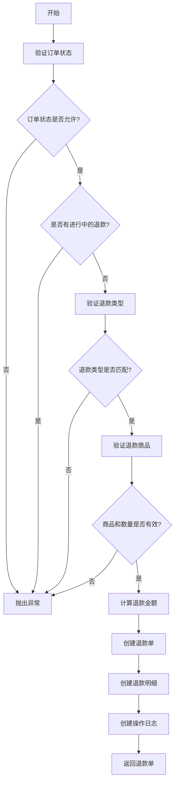
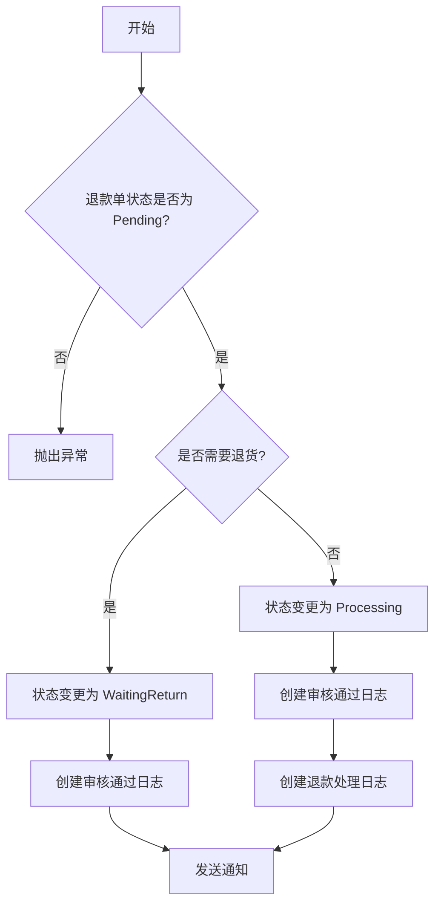
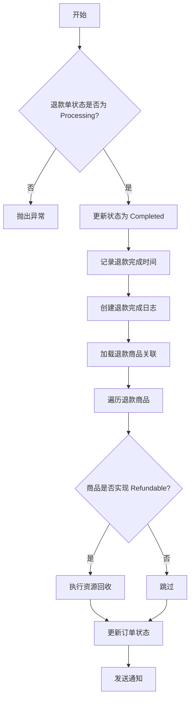

# RefundService API 文档

## 一、概述

`RefundService` 是退款服务的核心类，负责处理退款相关的业务逻辑，包括退款申请、审核、退货物流、退款确认等操作。

**文件路径：** `app/Services/Mall/RefundService.php`

**实现接口：** `ServiceInterface`

---

## 二、方法列表

| 方法 | 说明 | 访问级别 |
|------|------|----------|
| `createRefund()` | 创建退款申请 | public |
| `validateOrderForRefund()` | 验证订单是否可退款 | public |
| `cancelRefund()` | 取消退款 | public |
| `approveRefund()` | 审核通过 | public |
| `rejectRefund()` | 审核驳回 | public |
| `shipReturn()` | 提交退货物流 | public |
| `confirmReceive()` | 确认签收退货 | public |
| `confirmRefund()` | 确认退款完成 | public |
| `isOrderRefundable()` | 判断订单是否可退款 | public |

---

## 三、方法详情

### 3.1 createRefund() - 创建退款申请

创建退款申请，包括验证订单状态、验证退款商品、计算退款金额、创建退款单和退款明细。

**方法签名：**

```php
public function createRefund(Order $order, Authenticatable $user, array $data): Refund
```

**参数：**

| 参数 | 类型 | 必填 | 说明 |
|------|------|------|------|
| `$order` | `Order` | 是 | 订单对象 |
| `$user` | `Authenticatable` | 是 | 当前用户 |
| `$data` | `array` | 是 | 退款数据 |

**$data 结构：**

```php
[
    'type' => RefundType|string,      // 退款类型：OnlyRefund / ReturnRefund
    'reason' => RefundReason|string,  // 退款原因
    'reason_detail' => ?string,       // 原因详情（选"其他"时填写）
    'items' => [                       // 退款商品列表
        [
            'order_item_id' => int,    // 订单商品ID
            'qty' => int,              // 退款数量
            'price' => string,         // 单价
        ],
        // ...
    ],
]
```

**返回值：**

- `Refund` - 创建的退款单对象

**异常：**

| 异常类型 | 触发条件 |
|----------|----------|
| `InvalidArgumentException` | 订单状态不支持退款 |
| `InvalidArgumentException` | 已发货订单选择仅退款 |
| `InvalidArgumentException` | 退款商品不属于当前订单 |
| `InvalidArgumentException` | 退款数量超过可退数量 |
| `RuntimeException` | 已有退款申请正在处理中 |
| `Throwable` | 数据库事务异常 |

**业务流程：**



**代码示例：**

```php
use App\Services\Mall\RefundService;
use App\Enums\Mall\RefundType;
use App\Enums\Mall\RefundReason;

$refundService = app(RefundService::class);

$refund = $refundService->createRefund($order, $user, [
    'type' => RefundType::OnlyRefund,
    'reason' => RefundReason::QualityIssue,
    'reason_detail' => '商品有质量问题',
    'items' => [
        [
            'order_item_id' => 1,
            'qty' => 1,
            'price' => '99.00',
        ],
    ],
]);
```

---

### 3.2 validateOrderForRefund() - 验证订单是否可退款

验证订单状态是否允许退款，以及是否已有进行中的退款单。

**方法签名：**

```php
public function validateOrderForRefund(Order $order): void
```

**参数：**

| 参数 | 类型 | 必填 | 说明 |
|------|------|------|------|
| `$order` | `Order` | 是 | 订单对象 |

**异常：**

| 异常类型 | 触发条件 |
|----------|----------|
| `InvalidArgumentException` | 订单状态不支持退款 |
| `RuntimeException` | 已有退款申请正在处理中 |

**允许退款的订单状态：**

- `Paid` - 已支付/待发货
- `Preparing` - 备货中
- `PartiallyShipped` - 部分发货
- `Delivered` - 已发货
- `Signed` - 已签收
- `Completed` - 已完成

**进行中的退款状态：**

- `Pending` - 待审核
- `WaitingReturn` - 等待退货
- `Shipping` - 退货中
- `Received` - 已签收
- `Processing` - 退款处理中

---

### 3.3 cancelRefund() - 取消退款

取消退款申请，仅支持取消待审核状态的退款单。

**方法签名：**

```php
public function cancelRefund(Refund $refund, Authenticatable $user): void
```

**参数：**

| 参数 | 类型 | 必填 | 说明 |
|------|------|------|------|
| `$refund` | `Refund` | 是 | 退款单对象 |
| `$user` | `Authenticatable` | 是 | 当前用户 |

**异常：**

| 异常类型 | 触发条件 |
|----------|----------|
| `RuntimeException` | 退款单状态不是 Pending |
| `Throwable` | 数据库事务异常 |

**业务流程：**

1. 验证退款单状态是否为 Pending
2. 更新退款单状态为 Cancelled
3. 创建操作日志（RefundLogAction::Cancelled）

**状态变更：** Pending → Cancelled

---

### 3.4 approveRefund() - 审核通过

审核通过退款申请，根据退款类型和订单状态自动判断下一步流转。

**方法签名：**

```php
public function approveRefund(Refund $refund, Authenticatable $user, ?string $remark = null): void
```

**参数：**

| 参数 | 类型 | 必填 | 说明 |
|------|------|------|------|
| `$refund` | `Refund` | 是 | 退款单对象 |
| `$user` | `Authenticatable` | 是 | 审核人 |
| `$remark` | `?string` | 否 | 审核备注 |

**异常：**

| 异常类型 | 触发条件 |
|----------|----------|
| `RuntimeException` | 退款单状态不是 Pending |
| `Throwable` | 数据库事务异常 |

**业务流程：**



**状态变更：**

- 仅退款 / 未发货订单：Pending → Processing
- 退货退款 / 已发货订单：Pending → WaitingReturn

**通知：** 审核通过后发送 `RefundApprovedNotification` 通知租户

---

### 3.5 rejectRefund() - 审核驳回

审核驳回退款申请。

**方法签名：**

```php
public function rejectRefund(Refund $refund, Authenticatable $user, string $remark): void
```

**参数：**

| 参数 | 类型 | 必填 | 说明 |
|------|------|------|------|
| `$refund` | `Refund` | 是 | 退款单对象 |
| `$user` | `Authenticatable` | 是 | 审核人 |
| `$remark` | `string` | 是 | 驳回原因 |

**异常：**

| 异常类型 | 触发条件 |
|----------|----------|
| `RuntimeException` | 退款单状态不是 Pending |
| `Throwable` | 数据库事务异常 |

**业务流程：**

1. 验证退款单状态是否为 Pending
2. 更新退款单状态为 Rejected
3. 记录审核人、审核时间、审核备注
4. 创建操作日志（RefundLogAction::Rejected）
5. 发送驳回通知

**状态变更：** Pending → Rejected（终态）

**通知：** 审核驳回后发送 `RefundRejectedNotification` 通知租户

---

### 3.6 shipReturn() - 提交退货物流

用户提交退货物流信息。

**方法签名：**

```php
public function shipReturn(Refund $refund, Authenticatable $user, array $expressData): void
```

**参数：**

| 参数 | 类型 | 必填 | 说明 |
|------|------|------|------|
| `$refund` | `Refund` | 是 | 退款单对象 |
| `$user` | `Authenticatable` | 是 | 当前用户 |
| `$expressData` | `array` | 是 | 物流数据 |

**$expressData 结构：**

```php
[
    'express_id' => int,     // 物流公司ID
    'express_no' => string,  // 物流单号
]
```

**异常：**

| 异常类型 | 触发条件 |
|----------|----------|
| `RuntimeException` | 退款单状态不是 WaitingReturn |
| `Throwable` | 数据库事务异常 |

**业务流程：**

1. 验证退款单状态是否为 WaitingReturn
2. 创建或更新退货物流记录（RefundExpress）
3. 更新退款单状态为 Shipping
4. 创建操作日志（RefundLogAction::ReturnShipped）

**状态变更：** WaitingReturn → Shipping

---

### 3.7 confirmReceive() - 确认签收退货

商户确认签收退货商品。

**方法签名：**

```php
public function confirmReceive(Refund $refund, Authenticatable $user, ?string $remark = null): void
```

**参数：**

| 参数 | 类型 | 必填 | 说明 |
|------|------|------|------|
| `$refund` | `Refund` | 是 | 退款单对象 |
| `$user` | `Authenticatable` | 是 | 操作人 |
| `$remark` | `?string` | 否 | 备注 |

**异常：**

| 异常类型 | 触发条件 |
|----------|----------|
| `RuntimeException` | 退款单状态不是 Shipping |
| `Throwable` | 数据库事务异常 |

**业务流程：**

1. 验证退款单状态是否为 Shipping
2. 更新退货物流状态为 Received
3. 更新退款单状态为 Processing
4. 创建签收日志（RefundLogAction::ReturnReceived）
5. 创建退款处理日志（RefundLogAction::Processing）

**状态变更：** Shipping → Received → Processing

---

### 3.8 confirmRefund() - 确认退款完成

确认退款完成，执行退款资源回收。

**方法签名：**

```php
public function confirmRefund(Refund $refund, Authenticatable $user, ?string $remark = null): void
```

**参数：**

| 参数 | 类型 | 必填 | 说明 |
|------|------|------|------|
| `$refund` | `Refund` | 是 | 退款单对象 |
| `$user` | `Authenticatable` | 是 | 操作人 |
| `$remark` | `?string` | 否 | 备注 |

**异常：**

| 异常类型 | 触发条件 |
|----------|----------|
| `RuntimeException` | 退款单状态不是 Processing |
| `Throwable` | 数据库事务异常 |

**业务流程：**



**状态变更：** Processing → Completed（终态）

**资源回收：**

- 实体商品 SKU：回退库存
- 虚拟权益 Identity：撤销已授予的身份
- 充值套餐：扣减账户余额

**订单状态更新：**

- 检查是否所有商品都已全额退款
- 如果全部退款完成，更新订单状态为 Signed/Completed

**通知：** 退款完成后发送 `RefundCompletedNotification` 通知租户

---

### 3.9 isOrderRefundable() - 判断订单是否可退款

判断订单是否可以发起退款申请。

**方法签名：**

```php
public function isOrderRefundable(Order $order): bool
```

**参数：**

| 参数 | 类型 | 必填 | 说明 |
|------|------|------|------|
| `$order` | `Order` | 是 | 订单对象 |

**返回值：**

- `bool` - 是否可退款

**代码示例：**

```php
$refundService = app(RefundService::class);

if ($refundService->isOrderRefundable($order)) {
    // 显示退款按钮
}
```

---

## 四、内部方法

### 4.1 validateRefundType() - 验证退款类型

验证退款类型与订单状态的匹配性。

```php
private function validateRefundType(Order $order, RefundType|string $type): void
```

**规则：**
- 已发货订单（Delivered/Signed/Completed）不支持"仅退款"

---

### 4.2 validateRefundItems() - 验证退款商品

验证退款商品和数量的有效性。

```php
private function validateRefundItems(Order $order, array $items): void
```

**规则：**
- 退款商品必须属于当前订单
- 退款数量不能超过可退数量

**可退数量计算：**

```php
$refundableQty = $orderItem->qty - $orderItem->refundItems()
    ->whereHas('refund', fn ($q) => $q->whereIn('status', [
        RefundStatus::Pending,
        RefundStatus::WaitingReturn,
        RefundStatus::Shipping,
        RefundStatus::Received,
        RefundStatus::Processing,
    ]))
    ->sum('qty');
```

---

### 4.3 calculateRefundAmount() - 计算退款金额

计算退款金额明细。

```php
private function calculateRefundAmount(array $items, RefundType|string $type): array
```

**返回值：**

```php
[
    'goods_amount' => string,    // 商品退款金额
    'freight_amount' => string,  // 运费退款金额（当前固定为 0.00）
    'total' => string,           // 总退款金额
]
```

---

### 4.4 needsReturn() - 判断是否需要退货

根据退款类型和订单状态判断是否需要退货。

```php
private function needsReturn(Refund $refund, Order $order): bool
```

**规则：**
- 未发货订单（Paid/Preparing）：不需要退货
- 已发货订单：需要退货

---

### 4.5 updateOrderStatusAfterRefund() - 退款后更新订单状态

退款完成后检查是否需要更新订单状态。

```php
private function updateOrderStatusAfterRefund(Order $order): void
```

**规则：**
- 检查所有商品是否都已全额退款
- 如果全部退款完成：
  - 订单状态为 Signed → 更新为 Completed
  - 其他状态 → 更新为 Signed

---

## 五、异常处理

| 异常类型 | 说明 | 处理建议 |
|----------|------|----------|
| `InvalidArgumentException` | 参数验证失败 | 提示用户修改输入 |
| `RuntimeException` | 业务逻辑错误 | 提示用户当前状态不允许操作 |
| `Throwable` | 系统异常 | 记录日志，提示用户稍后重试 |

---

## 六、事件与通知

### 6.1 通知

| 通知类 | 触发时机 | 接收者 |
|--------|----------|--------|
| `RefundApprovedNotification` | 审核通过 | 租户 |
| `RefundRejectedNotification` | 审核驳回 | 租户 |
| `RefundCompletedNotification` | 退款完成 | 租户 |

### 6.2 事件

| 事件类 | 触发时机 |
|--------|----------|
| `RefundInitialized` | 退款创建 |
| `RefundCompleted` | 退款完成 |
| `RefundFailed` | 退款失败 |

---

## 七、依赖注入

```php
use App\Services\Mall\RefundService;

// 方式1：通过容器解析
$refundService = app(RefundService::class);

// 方式2：通过构造函数注入
public function __construct(
    protected RefundService $refundService,
) {}

// 方式3：通过 service() 辅助函数
$refundService = service(RefundService::class);
```

---

## 八、使用示例

### 8.1 创建退款单

```php
$refund = $refundService->createRefund($order, $user, [
    'type' => RefundType::OnlyRefund,
    'reason' => RefundReason::QualityIssue,
    'reason_detail' => null,
    'items' => [
        [
            'order_item_id' => 1,
            'qty' => 1,
            'price' => '99.00',
        ],
    ],
]);
```

### 8.2 审核退款

```php
// 审核通过
$refundService->approveRefund($refund, $admin, '同意退款');

// 审核驳回
$refundService->rejectRefund($refund, $admin, '不符合退款条件');
```

### 8.3 退货流程

```php
// 提交退货物流
$refundService->shipReturn($refund, $user, [
    'express_id' => 1,
    'express_no' => 'SF1234567890',
]);

// 确认签收
$refundService->confirmReceive($refund, $admin, '已签收');

// 确认退款
$refundService->confirmRefund($refund, $admin, '退款完成');
```

### 8.4 取消退款

```php
$refundService->cancelRefund($refund, $user);
```

### 8.5 检查是否可退款

```php
if ($refundService->isOrderRefundable($order)) {
    // 显示退款按钮
}
```
