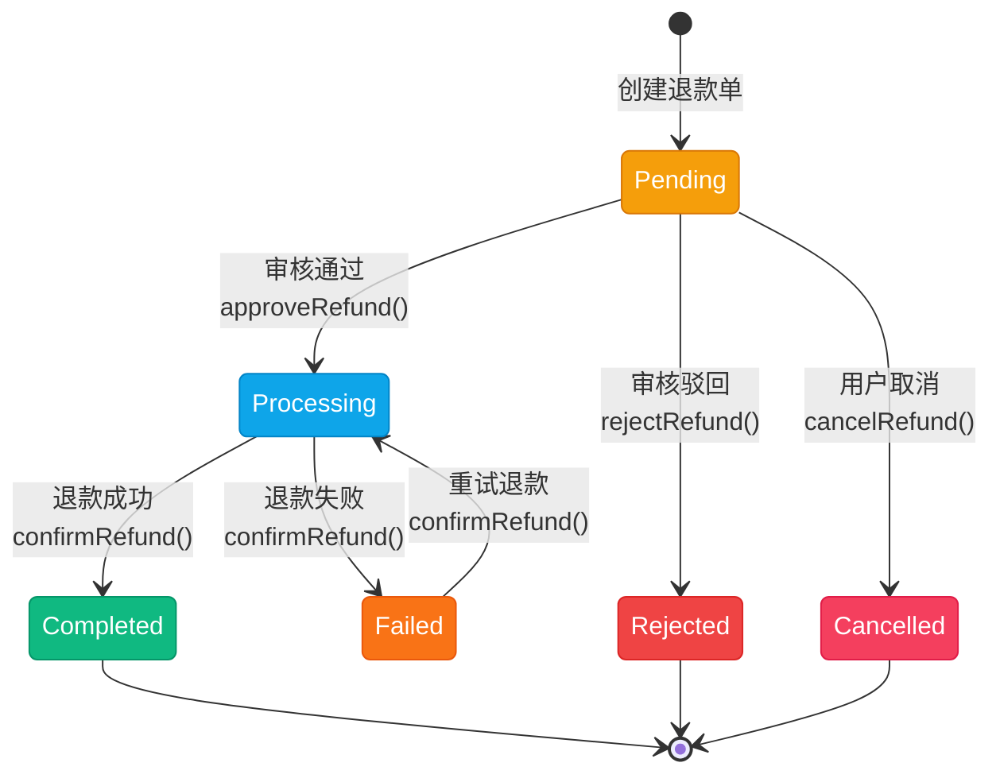
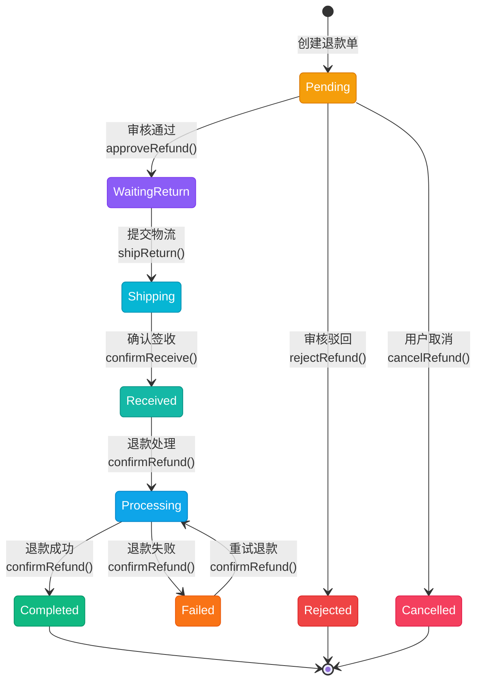
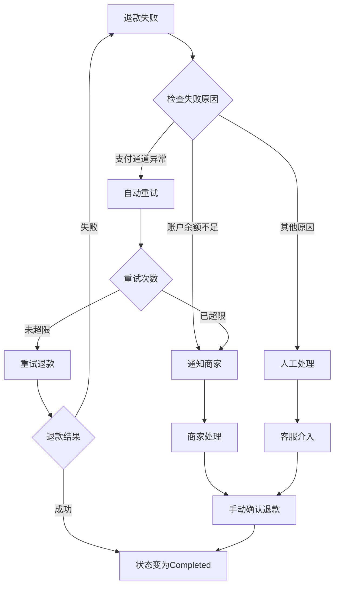

# 退款状态流转图

## 一、状态说明

| 状态 | 英文 | 说明 | 颜色 |
|------|------|------|------|
| 待审核 | Pending | 退款申请已提交，等待审核 | amber |
| 等待退货 | WaitingReturn | 审核通过，等待用户寄回商品 | violet |
| 退货中 | Shipping | 用户已提交物流信息，商品在途 | cyan |
| 已签收 | Received | 商家已签收退货商品 | teal |
| 退款处理中 | Processing | 系统正在处理退款（仅退款直接到此状态） | sky |
| 退款完成 | Completed | 退款成功，资金已退还 | emerald |
| 审核拒绝 | Rejected | 审核不通过，退款申请被拒绝 | red |
| 已取消 | Cancelled | 用户主动取消退款申请 | rose |
| 退款失败 | Failed | 退款处理失败（如支付通道异常） | orange |

---

## 二、状态流转图

### 2.1 仅退款 (OnlyRefund)



**状态流转：**
- Pending → Processing → Completed / Failed
- Pending → Rejected（终态）
- Pending → Cancelled（终态）
- Failed ⇄ Processing（可重试）

### 2.2 退货退款 (ReturnRefund)



**状态流转：**
- Pending → WaitingReturn → Shipping → Received → Processing → Completed / Failed
- Pending → Rejected（终态）
- Pending → Cancelled（终态）
- Failed ⇄ Processing（可重试）

### 2.3 完整状态流转图

```mermaid
stateDiagram-v2
    [*] --> Pending : 创建退款单
    
    state "Pending" as Pending {
        state "待审核" as pending_desc
    }
    
    state "退款类型判断" as type_check <<choice>>
    
    Pending --> type_check : 审核通过
    
    state "仅退款流程" as only_refund {
        Processing --> Completed : 退款成功
        Processing --> Failed : 退款失败
        Failed --> Processing : 重试
    }
    
    state "退货退款流程" as return_refund {
        WaitingReturn --> Shipping : 提交物流
        Shipping --> Received : 确认签收
        Received --> Processing : 退款处理
        Processing --> Completed : 退款成功
        Processing --> Failed : 退款失败
        Failed --> Processing : 重试
    }
    
    type_check --> Processing : 仅退款
    type_check --> WaitingReturn : 退货退款
    
    Pending --> Rejected : 审核驳回
    Pending --> Cancelled : 用户取消
    
    Completed --> [*]
    Rejected --> [*]
    Cancelled --> [*]
```

---

## 三、状态流转规则

### 3.1 按退款类型

| 当前状态 | 仅退款可流转到 | 退货退款可流转到 |
|----------|----------------|------------------|
| Pending | Processing, Rejected, Cancelled | WaitingReturn, Rejected, Cancelled |
| WaitingReturn | - | Shipping |
| Shipping | - | Received |
| Received | - | Processing |
| Processing | Completed, Failed | Completed, Failed |
| Failed | Processing | Processing |
| Completed | - | - |
| Rejected | - | - |
| Cancelled | - | - |

### 3.2 操作对应状态流转

| 操作 | 方法 | 前置状态 | 后置状态 |
|------|------|----------|----------|
| 创建退款 | createRefund() | - | Pending |
| 审核通过 | approveRefund() | Pending | Processing (仅退款) / WaitingReturn (退货退款) |
| 审核驳回 | rejectRefund() | Pending | Rejected |
| 取消退款 | cancelRefund() | Pending | Cancelled |
| 提交退货物流 | shipReturn() | WaitingReturn | Shipping |
| 确认签收 | confirmReceive() | Shipping | Received |
| 确认退款 | confirmRefund() | Processing | Completed / Failed |

---

## 四、终态说明

| 终态 | 说明 | 是否可删除 |
|------|------|------------|
| Completed | 退款完成，资金已退还 | 否 |
| Rejected | 审核拒绝，退款申请被驳回 | 是 |
| Cancelled | 用户主动取消退款申请 | 是 |
| Failed | 退款处理失败 | 否（需重试或人工处理） |

---

## 五、退款失败重试

当退款处理失败（Failed）时：

1. 系统记录失败原因
2. 支持重试操作（重试后状态回到 Processing）
3. 重试次数限制由业务配置决定
4. 超过重试次数后需人工介入处理


