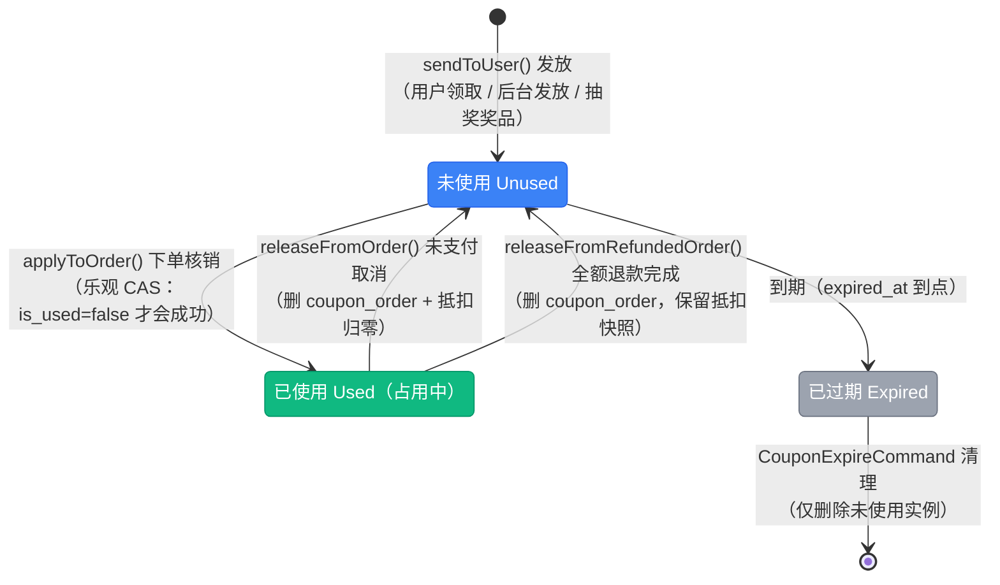
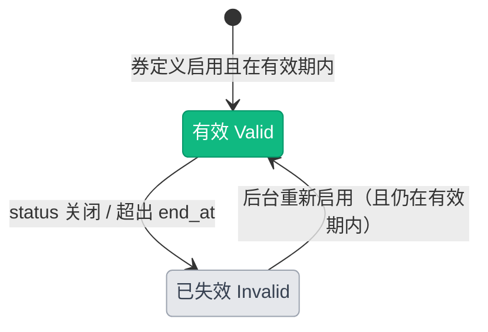

# 优惠券状态流转图

> 优惠券**没有状态枚举**，状态由 `coupon_user` 表上的三个字段组合表达：`is_used`（是否已核销）、`used_at`（核销时间）、`expired_at`（实例过期时间），再由关系表 `coupon_order` 是否存在记录判断「占用中」还是「已返还」。券定义侧的可用性由 `App\Models\Campaign\Coupon::isValid()`（`status` 开关 + `start_at` / `end_at` 有效期）决定。核销与返还逻辑见 `App\Services\Campaign\CouponService`，设计文档见 [优惠券系统开发方案](../development/coupon-system.md)。

## 一、状态说明

### 1.1 券实例状态（`coupon_user`）

| 状态 | 判定条件 | 说明 |
|------|----------|------|
| 未使用 | `is_used = false`，且未过期 | 用户可用状态 |
| 已使用（占用中） | `is_used = true`、`used_at` 非空，且 `coupon_order` 有一条记录 | 已锁定到某个订单 |
| 已返还 | `is_used = false`、`used_at = null`，`coupon_order` 记录已删除 | 取消订单 / 全额退款后释放；若实例已过期则自动落到「已过期」 |
| 已过期 | `expired_at <= now()` | 不可用；每日清理任务会删除**未使用**的过期实例 |
| 已失效（券定义侧） | `coupon.status = false`，或不在 `[start_at, end_at]` 内 | 该券的所有实例一律不可用（`Coupon::isValid()`） |

### 1.2 券定义状态（`coupons`）

| 维度 | 字段 | 说明 |
|------|------|------|
| 启停 | `status`（布尔） | 后台开关，停用后所有实例失效 |
| 有效期 | `start_at` / `end_at` | 为空表示该侧不限制 |
| 发放上限 | `usage_limit` | 已发放实例数达上限后不可再领（`Coupon::canBeUsed()`） |

---

## 二、状态流转图

**状态流转：**

- 发放 → 未使用：`sendToUser()` 写入实例并设置 `expired_at`，规则由券定义的 `expired_type`（`ExpiredType`）决定：
  - 固定期限 `fixed` → `expired_at` 取券定义的 `end_at`
  - 领取后生效 `receive` → `expired_at = now() + days`（`days > 0` 时），否则为 `null`（永不过期）
- 未使用 → 已使用：下单核销，**乐观 CAS**（`UPDATE ... WHERE id = ? AND is_used = false`），影响行数为 0 时抛「优惠券已被使用」
- 已使用 → 未使用：两条路径
  - 未支付取消订单 → `releaseFromOrder()`：删除 `coupon_order`、`coupon_discount` 归零、实例回置未使用
  - 全额退款完成 → `releaseFromRefundedOrder()`：删除 `coupon_order`、实例回置未使用，但**保留** `coupon_discount` 快照（订单实付是既成事实，开票等场景依赖该口径）
- 未使用 → 已过期：由 `expired_at` 到点触发；实例**不会自动变成已使用之外的持久状态**，「已过期」是读时判定
- 已过期 → 删除：`app:campaign:coupon-expire` 每日删除「未使用且已过期」的实例；**已核销的记录保留**（`coupon_order` 依赖）

---

## 三、核销校验规则

来源：`CouponService::validateAndCalculate()`（`app/Services/Campaign/CouponService.php:320`），预览（`previewDiscount()`）与实际核销（`applyToOrder()`）共用同一条路径，保证展示金额与实扣一致。

| 序号 | 校验项 | 失败提示 |
|------|--------|----------|
| 1 | 券实例归属当前用户 | 优惠券不属于当前用户 |
| 2 | 券实例未使用（`is_used = false`） | 优惠券已被使用 |
| 3 | 券实例未过期（`expired_at`） | 优惠券已过期 |
| 4 | 券定义有效（`status` + 有效期） | 优惠券已失效 |
| 5 | 券租户 = 订单租户 | 优惠券不适用于所选商品 |
| 6 | 有适用商品（`baseAmountFor()` 计算抵扣基数） | 优惠券不适用于所选商品 |
| 7 | 抵扣计算与 clamp（商品实付最低 0.01，券不作用于运费） | - |

**金额口径：** 抵扣金额按订单项小计比例分摊到各订单项 `coupon_discount`（尾差归位到金额最大的项），退款时按该快照分摊，不再重算。

---

## 四、操作对应状态流转

来源：`App\Services\Campaign\CouponService`、`App\Services\Mall\OrderService`、`App\Services\Mall\RefundService`。

| 操作 | 方法 | 入口 | 前置状态 | 后置状态 |
|------|------|------|----------|----------|
| 发放（用户领取） | `sendToUser()` | 用户端 `POST /coupons/{coupon}/claim`（`routes/apis/campaign.php:36` → `CouponController::claim()`） | 券可发放 | 新建实例（未使用） |
| 发放（后台） | `sendToUser()` | 后台优惠券 → 用户子表「发放」动作（`UsersRelationManager:77`） | 券可发放 | 新建实例 |
| 发放（抽奖奖品） | `sendToUser()` | 抽奖中奖记录兑奖（`LotteryService::fulfillCouponPrize()`:309） | 中奖记录 Pending | 实例（未使用）+ 记录 Fulfilled |
| 预览抵扣 | `previewDiscount()` | 购物车 / 下单预览（`CartController:180`、`OrderController:147`） | 不计状态变化 | 不变 |
| 下单核销 | `applyToOrder()` | 下单流程（`OrderService:210`） | 实例未使用且 7 项校验通过 | 已使用 + 写 `coupon_order` |
| 取消订单返还 | `releaseFromOrder()` | 订单取消（`OrderService:357`） | 订单持有该券 | 未使用（抵扣归零） |
| 全额退款返还 | `releaseFromRefundedOrder()` | 退款完成（`RefundService:742`） | 订单持有该券 | 未使用（保留抵扣快照） |
| 过期清理 | `CouponExpireCommand` | 每日调度 `app:campaign:coupon-expire`（`routes/console.php:28`） | 未使用且已过期 | 删除实例 |

**发放入口的前置校验：** `Coupon::canBeUsed()`（券有效 + 未达发放上限）与 `doSendToUser()` 内的**两级精确限额校验** —— 总发放上限 `usage_limit`、每人限领 `usage_limit_per_user`（超限分别抛「优惠券发放已达上限」「您已领取过该优惠券，不可重复领取」）；`sendToUser()` 外层用缓存锁 `lock->block(5)` 防止并发超发（:414）。

---

## 五、资金与副作用

| 时点 | 副作用 | 位置 |
|------|--------|------|
| 发放 | 逐条写入 `coupon_user`（含 `expired_at`），事务内校验每用户限领数量 | `doSendToUser()`（:432-472） |
| 核销 | 写 `orders.coupon_discount`、按比例写各订单项 `coupon_discount`、`coupon_order` 关联 `discount_amount` | `applyToOrder()`（:166-194） |
| 返还（取消） | 删 `coupon_order`、订单抵扣归零、实例回置未使用；**券若已过期仍回置为未使用**（过期由 `expired_at` 表达，不重复占用发放额度） | `doRelease()`（:286-306） |
| 返还（退款） | 同上，但保留 `orders.coupon_discount` 快照 | `releaseFromRefundedOrder()`（:275） |
| 过期清理 | 删除未使用实例（`chunkById(500)` 分批） | `CouponExpireCommand`（`app/Console/Commands/Campaign/CouponExpireCommand.php:21`） |

**无资金流水**：优惠券只影响订单金额口径，不写 `user_account_logs`。

**并发与幂等：**

- 核销用**乐观锁**（`WHERE is_used = false` 的条件更新），并发下单时只有一笔成功，其余抛「优惠券已被使用」
- 返还 `doRelease()` 幂等：找不到 `coupon_order` 记录直接 `return`，重复回调不会误改
- 发放用缓存锁 `block(5)` 串行化，防止并发重复发放超过限领

---

## 六、实现缺口

| 缺口 | 影响 | 相关位置 |
|------|------|----------|
| 券实例无状态枚举 | 状态靠字段组合推断，新入口容易漏判（例如忘记查 `coupon_order`） | `coupon_user` 表 |
| 部分退款不返还 | 只有**全额**退款才返还券，部分退款时券保持已使用 | `RefundService:742` 的调用条件 |
| 过期清理无中间态 | 过期实例是「读时判定 + 每日物理删除」，没有 `expired` 字段留痕 | `CouponExpireCommand` |
| 返还后不恢复发放额度 | 券若在过期后被返还，仍恢复 `is_used = false`（设计如此），但已过期的实例不可用 | `doRelease()`（:303） |
| 无失效通知 | 券被停用 / 过期不会通知持有用户 | 无事件派发 |

---

## 七、终态说明

| 状态 | 说明 | 是否可删除 |
|------|------|------------|
| 已使用（订单已完成） | 核销记录保留（`coupon_order` 依赖），不可返还 | 否 |
| 已过期 | 未使用的过期实例由每日任务物理删除 | 是（任务删除） |
| 券定义停用 | 实例保留但不可用，可重新启用 | 是（软删除） |
