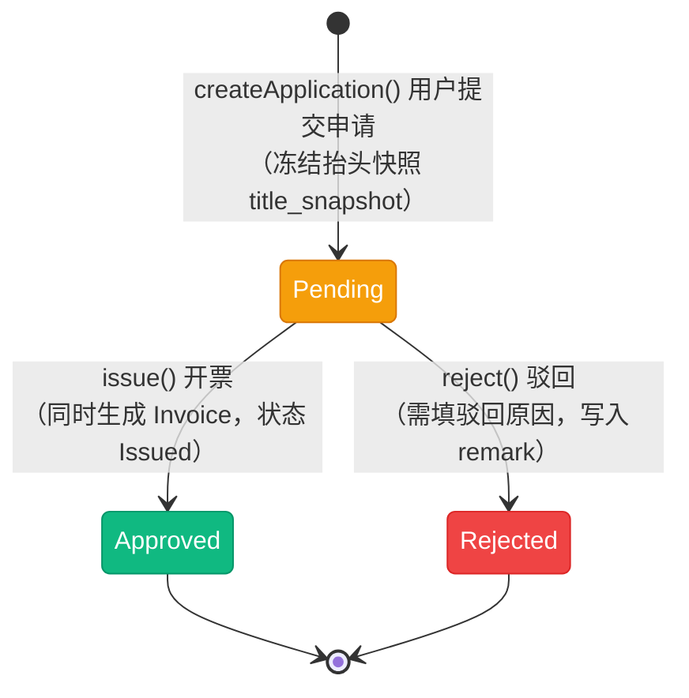

# 发票状态流转图

> 发票链路有两个状态枚举：申请单 `App\Enums\Finance\InvoiceApplicationStatus`（模型 `App\Models\Finance\InvoiceApplication`）与发票 `App\Enums\Finance\InvoiceStatus`（模型 `App\Models\Finance\Invoice`）。二者**均未实现 `HasStateMachine`**，流转由 `App\Services\Finance\InvoiceService` 的前置状态校验维护。链路为「用户提交申请 → 租户 / 后台开票或驳回 → 生成发票」，申请与发票通过 `invoice_application_id` 关联（申请没有「已开票」状态）。

## 一、状态说明

### 1.1 发票申请（`InvoiceApplicationStatus`）

| 状态 | 枚举 | 值 | 颜色 | 说明 |
|------|------|-----|------|------|
| 待处理 | Pending | `pending` | warning | 申请已提交，等待开票或驳回 |
| 已批准 | Approved | `approved` | success | 已开票（同时生成发票记录） |
| 已拒绝 | Rejected | `rejected` | danger | 不满足开票条件，被驳回 |

### 1.2 发票（`InvoiceStatus`）

| 状态 | 枚举 | 值 | 颜色 | 说明 |
|------|------|-----|------|------|
| 已开具 | Issued | `issued` | success | 开票时写入的初始状态 |
| 已发送 | Sent | `sent` | info | 已发送给用户（**未实现**） |

---

## 二、状态流转图

### 2.1 申请单



**状态流转：**

- Pending → Approved 与 Pending → Rejected 均要求申请处于 `Pending`，否则抛「只能开具 / 拒绝待处理的发票申请」
- 开票在 `DB::transaction` 内完成两件事：申请转 `Approved` + 创建发票（`Issued`）
- 无撤销 / 重新开票路径：`Approved` 与 `Rejected` 都是终态

### 2.2 发票

```mermaid
stateDiagram-v2
    [*] --> Issued : issue() 开票写入

    state "已发送 Sent（未实现）" as Sent
    Issued -.-> Sent : 无写入方

    classDef issued fill:#10b981,stroke:#059669,color:white
    classDef missing fill:#e5e7eb,stroke:#9ca3af,color:#374151

    class Issued issued
    class Sent missing
```

**状态流转：**

- 发票只有 `Issued` 一个可达状态，创建时即写入（`InvoiceService::issue()`）
- `Sent` 无任何写入方：没有发送发票 / 邮件通知的实现

---

## 三、状态流转规则

无状态机约束，下表为**各方法校验后代码实际允许**的流转。

| 对象 | 当前状态 | 可流转到 | 触发 | 校验位置 |
|------|----------|----------|------|----------|
| 申请 | - | Pending | `createApplication()` | `app/Services/Finance/InvoiceService.php:59` |
| 申请 | Pending | Approved | `issue()` | 同上（:204） |
| 申请 | Pending | Rejected | `reject()` | 同上（:244） |
| 申请 | Approved / Rejected | -（终态） | - | 复核会被前置校验拒绝 |
| 发票 | - | Issued | `issue()` | 同上（:213） |
| 发票 | Issued | -（无入口） | 发送 | 未实现 |
| 发票 | Sent | -（无入口） | - | 未实现 |

### 申请前置校验（`validateOrders()`，`InvoiceService.php:123`）

提交申请时逐条校验关联订单，任一不满足即抛 `RuntimeException`：

| 校验项 | 失败提示 |
|--------|----------|
| 订单均存在（`count` 与传入 ID 数一致） | 部分订单不存在 |
| 订单租户 = 申请租户 | 订单与申请租户不一致 |
| 订单归属当前用户 | 只能为自己的订单申请开票 |
| 订单非 `Pending` / `Canceled` | 订单未支付或已取消，不可开票 |
| 无有效退款（`RefundStatus::effectiveCases()`：Pending / WaitingReturn / Shipping / Received / Processing / Completed） | 订单已申请退款，不可开票 |
| 订单未被其他 `Pending` / `Approved` 申请占用 | 订单已申请过开票 |

**金额口径：** 传入 `order_ids` 时开票金额由关联订单累加得出（`Σ(订单商品金额 + 运费)`，运费按价外费用一并开票）；未传时使用入参 `amount`（`calculateAmountFromOrders()`，:181）。

**抬头快照：** 申请提交时把 `InvoiceTitle` 的关键字段冻结为 `title_snapshot`（:89），抬头后续被修改 / 删除不影响历史申请与发票。

---

## 四、操作对应状态流转

来源：`App\Services\Finance\InvoiceService`、`app/Filament/Actions/Finance/`、`app/Http/Controllers/User/InvoiceController.php`。

| 操作 | 方法 | 入口 | 前置状态 | 后置状态 |
|------|------|------|----------|----------|
| 提交开票申请 | `createApplication()` | 用户端 `POST /invoices/applications`（`InvoiceController::apply()`） | 订单需通过上述 6 项校验 | 新建申请 Pending |
| 查询可开票订单 | - | `GET /invoices/orders`（`invoicableOrders()`） | 任意 | 不变 |
| 查询申请 | - | `GET /invoices/applications`、`GET /invoices/applications/{application}` | 任意 | 不变 |
| 查询发票 / 统计 | - | `GET /invoices`、`GET /invoices/{invoice}`、`GET /invoices/stats` | 任意 | 不变 |
| 开具发票 | `issue()` | `IssueInvoiceAction`（后台 + 租户侧的列表页与详情页） | Pending | 申请 Approved + 发票 Issued |
| 驳回申请 | `reject()` | `RejectInvoiceApplicationAction`（租户侧列表 / 详情页；后台仅详情页） | Pending | Rejected |

---

## 五、资金与副作用

| 时点 | 副作用 | 位置 |
|------|--------|------|
| 提交申请 | 写入 `title_snapshot`；关联订单写入 `invoice_application_order`；派发 `InvoiceApplicationSubmitted` | `InvoiceService::createApplication()`（:59-74） |
| 提交申请（异步） | 队列监听 `SendInvoiceApplicationNotification` 给用户推送申请提交通知（`ShouldQueue`） | `app/Listeners/Finance/SendInvoiceApplicationNotification.php:15` |
| 开具发票 | 事务内申请转 `Approved` 并创建发票（`invoice_no` 唯一、`invoice_date`、`type`、`amount` 取申请金额、`creator`）；派发 `InvoiceIssued` | `InvoiceService::issue()`（:208-230） |
| 驳回申请 | 仅改状态并把驳回原因写入 `remark` | `InvoiceService::reject()`（:248） |

**无资金变动：** 开票不涉及余额 / 积分，不写 `user_account_logs`，仅与订单、抬头建立引用关系。

**幂等与并发：**

- 申请与开票的状态校验都在业务方法入口，重复开票 / 重复驳回会被前置校验拒绝
- 开票在 `DB::transaction` 内完成，失败整体回滚
- 同一订单的重复申请依靠 `validateOrders()` 的「无 Pending / Approved 申请」查询拦截，属**应用层校验**，并发提交仍可能产生重复申请（数据库层无唯一约束，`invoice_application_order` 仅对 `(application_id, order_id)` 唯一）

---

## 六、实现缺口

| 缺口 | 影响 | 相关位置 |
|------|------|----------|
| `InvoiceStatus::Sent` 无写入方 | 没有发送发票 / 邮件通知的实现，`Sent` 不可达 | 无发送逻辑 |
| 申请无撤销 | 用户提交后无法撤回，只能等租户 / 后台处理 | `app/Http/Controllers/User/InvoiceController.php` |
| 申请无「已开票」态 | 申请与发票割裂，需靠 `invoice_application_id` 反查 | `InvoiceApplicationStatus` 仅 3 态 |
| 无重新开票 | 发票信息填错无法作废重开 | 无作废 / 红冲逻辑 |
| 并发重复申请 | 应用层查重，无数据库层约束 | `validateOrders()`（:155） |
| 入口不对称 | 后端列表页只有「开具发票」没有「驳回」，驳回需进详情页 | `app/Filament/Backend/.../InvoiceApplications/Tables/InvoiceApplicationsTable.php:52` |

---

## 七、终态说明

| 对象 | 状态 | 说明 | 是否可删除 |
|------|------|------|------------|
| 申请 | Approved | 已开票，终态 | 否（发票关联） |
| 申请 | Rejected | 已驳回，终态 | 是（表支持软删除） |
| 发票 | Issued | 已开具，唯一可达状态 | 否 |
