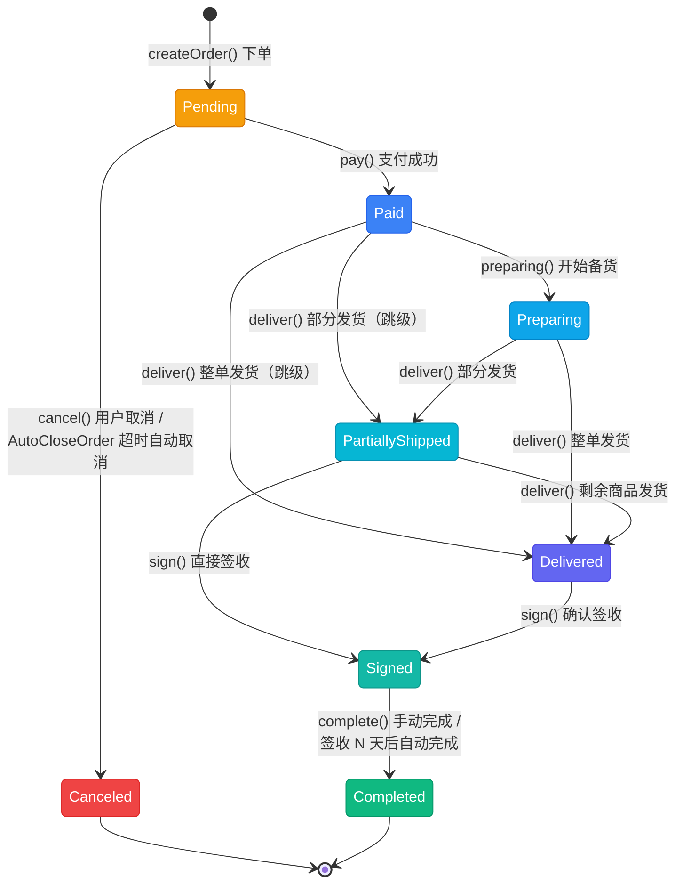
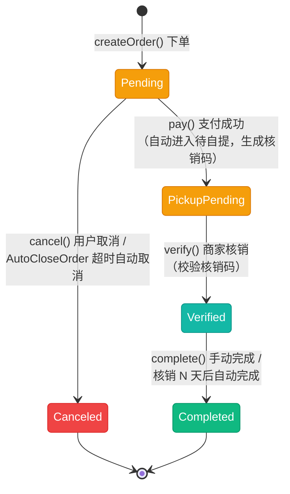
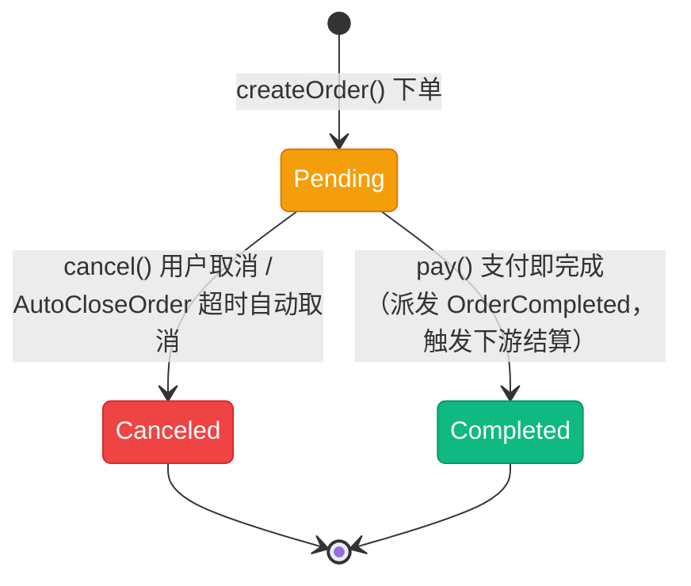
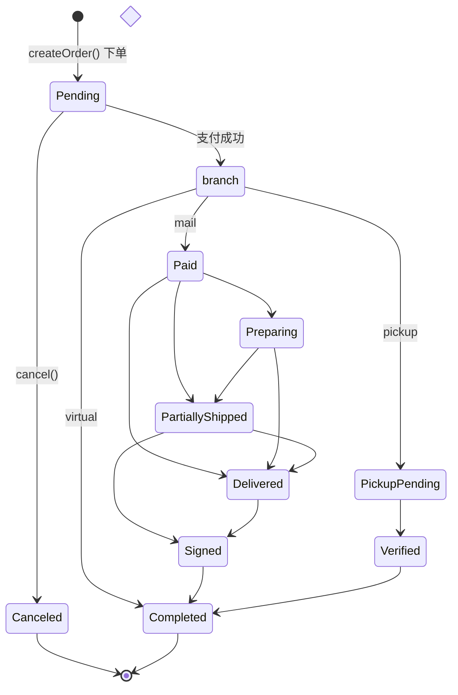

# 订单状态流转图

> 商城订单状态机（`App\Enums\Mall\OrderStatus`）按履约方式（`FulfillmentType`）分三条链路：快递邮寄（mail）、门店自提（pickup）、虚拟商品（virtual）。三条链路共享 `Pending` / `Canceled` / `Completed`，差异集中在付款后的中间段。流转合法性由 `HasStateMachine::canTransitionTo()` 基于 `next()` 判断，`OrderService::assertCan()` 传入订单履约方式校验。

## 一、状态说明

| 状态 | 枚举 | 值 | 颜色 | 所属链路 | 说明 |
|------|------|-----|------|----------|------|
| 待付款 | Pending | `pending` | amber | 共享 | 用户已下单，未付款 |
| 已取消 | Canceled | `canceled` | red | 共享（终态） | 用户未支付取消 / 超时未支付自动取消 |
| 待发货 | Paid | `paid` | blue | mail | 付款完成，等待发货 |
| 备货中 | Preparing | `preparing` | sky | mail | 打印订单、拣货、打包 |
| 部分发货 | PartiallyShipped | `partially` | cyan | mail | 部分商品已发货 |
| 已发货 | Delivered | `delivered` | indigo | mail | 卖家已发货 |
| 已签收 | Signed | `signed` | teal | mail | 用户已签收 |
| 已完成 | Completed | `completed` | emerald | 共享（终态） | 签收/核销 N 天后完成，不再操作 |
| 待自提 | PickupPending | `pickup_pending` | amber | pickup | 付款后进入，等待用户到店核销 |
| 已核销 | Verified | `verified` | teal | pickup | 商家核销通过，等价于 mail 链路的「已签收」 |

---

## 二、状态流转图

### 2.1 快递邮寄 (mail)

**状态流转：**

- Pending → Canceled（终态）/ Paid
- Paid → Preparing → PartiallyShipped → Delivered → Signed → Completed（终态）
- Paid 可跳级直接 PartiallyShipped / Delivered（发货不强制先备货）
- PartiallyShipped 可直接 Signed（部分发货后用户直接签收）

### 2.2 门店自提 (pickup)

**状态流转：**

- Pending → Canceled（终态）
- Pending → PickupPending → Verified → Completed（终态）
- 状态机层面为 `Pending → Paid → PickupPending`，但 `pay()` 一步推进，订单不停留在 Paid
- 核销码格式 `PICK-XXXX-XXXX-XXXX`（去除易混淆字符 0/O/1/I），付款时幂等生成

### 2.3 虚拟商品 (virtual)

**状态流转：**

- Pending → Canceled（终态）
- Pending → Completed（终态），无中间状态，支付成功直接完成

### 2.4 完整状态流转总览

---

## 三、状态流转规则

来源：`OrderStatus::next()` / `OrderStatus::previous()`（`previous()` 同样按履约方式区分 Completed 的前置状态）。

### 3.1 next()：可流转目标状态

| 当前状态 | mail | pickup | virtual |
|----------|------|--------|---------|
| Pending | Canceled, Paid | Canceled, Paid | Canceled, Paid |
| Paid | Preparing, PartiallyShipped, Delivered | PickupPending | Completed |
| Preparing | PartiallyShipped, Delivered | - | - |
| PartiallyShipped | Delivered, Signed | - | - |
| Delivered | Signed | - | - |
| Signed | Completed | - | - |
| PickupPending | - | Verified | - |
| Verified | - | Completed | - |
| Canceled | -（终态） | -（终态） | -（终态） |
| Completed | -（终态） | -（终态） | -（终态） |

### 3.2 previous()：前置状态

| 当前状态 | 前置状态 |
|----------|----------|
| Canceled | Pending |
| Paid | Pending |
| Preparing | Paid |
| PartiallyShipped | Paid, Preparing |
| Delivered | Paid, Preparing, PartiallyShipped |
| Signed | PartiallyShipped, Delivered |
| Completed | mail: Signed / pickup: Verified / virtual: Paid |
| PickupPending | Paid |
| Verified | PickupPending |

---

## 四、操作对应状态流转

来源：`App\Services\Mall\OrderService`。

| 操作 | 方法 | 前置状态 | 后置状态 |
|------|------|----------|----------|
| 创建订单 | `createOrder()` / `createOrders()` | - | Pending |
| 取消订单 | `cancel()` | Pending | Canceled（回退「下单扣减」的库存） |
| 支付成功 | `pay()` | Pending | mail: Paid / pickup: PickupPending（生成核销码）/ virtual: Completed |
| 开始备货 | `preparing()` | Paid | Preparing |
| 订单发货 | `deliver()` | Paid, Preparing, PartiallyShipped | 全部发货: Delivered / 部分发货: PartiallyShipped |
| 删除发货记录 | `deleteExpress()` | Delivered, PartiallyShipped | 按剩余发货量回退（见下方说明） |
| 确认签收 | `sign()` | Delivered, PartiallyShipped | Signed（记录 signed_at） |
| 自提核销 | `verify()` | PickupPending | Verified（校验核销码，记录核销人/时间） |
| 完成订单 | `complete()` | mail: Signed / pickup: Verified / virtual: Paid | Completed |
| 删除订单 | `delete()` | Pending, Canceled | 软删除（不改变状态） |

> **发货记录回退（旁路状态机）：** `deleteExpress()` 删除发货记录后按剩余发货量直接改写状态——全部回退时 `Delivered` / `PartiallyShipped` → `Paid`，部分回退时 → `PartiallyShipped`。该回退不经过 `canTransitionTo()` 校验（如 `Delivered → Paid` 不在 `next()` 映射内），属状态机旁路操作。

---

## 五、自动化流转

| 任务 | 触发 | 规则 |
|------|------|------|
| `AutoCloseOrder`（延迟任务） | 下单时调度 | 仅 `Pending` 状态执行；超时未支付自动 `cancel()`（超时时间由店铺配置） |
| `OrderAutoCompleteCommand`（`app:mall:order-auto-complete`） | 定时调度 | mail 扫「已签收」、pickup 扫「已核销」，N 天后（店铺配置 `auto_complete_days`，默认 7 天）自动 `complete()`；virtual 支付即完成，无需扫描 |

---

## 六、终态说明

| 终态 | 说明 | 是否可删除 |
|------|------|------------|
| Canceled | 未支付取消 / 超时自动取消 | 是（`delete()` 允许 Pending / Canceled 删除） |
| Completed | 订单完结，触发下游结算（`ShouldSettlement`） | 否 |
