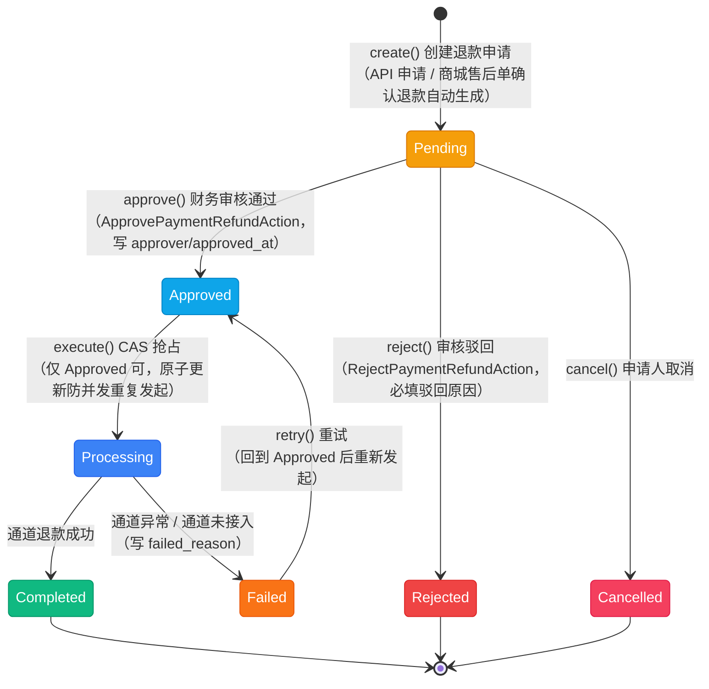
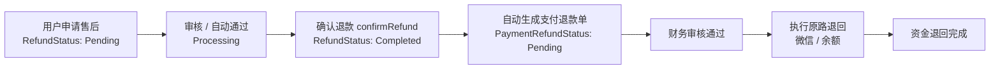

# 支付退款单状态流转图

> 支付退款单状态（`App\Enums\Finance\PaymentRefundStatus`），模型 `App\Models\Finance\PaymentRefund`，服务 `App\Services\Finance\PaymentRefundService`。该枚举**未实现 `HasStateMachine`**，流转由服务层用「带状态条件的原子更新」+ 审核动作控制。退款资金一律**走原支付通道**：微信支付原路退回微信（微信 v3 退款接口），余额支付退回用户余额。商城售后单在确认退款时会自动生成一张待审核的支付退款单，两张单据的关系见 2.2。

## 一、状态说明

| 状态 | 枚举 | 值 | 颜色 | 说明 |
|------|------|-----|------|------|
| 待审核 | Pending | `pending` | amber | 退款申请已提交，等待财务审核（申请即占用可退额度） |
| 审核通过 | Approved | `approved` | sky | 审核通过，等待执行原路退回 |
| 退款处理中 | Processing | `processing` | blue | 已发起通道退款；微信返回异步处理中时停留在此 |
| 退款完成 | Completed | `completed` | emerald | 资金已退回（写 `refunded_at` 与通道退款单号） |
| 已拒绝 | Rejected | `rejected` | red | 审核驳回，写 `rejected_reason` |
| 已取消 | Cancelled | `cancelled` | rose | 申请人取消（仅待审核可取消） |
| 退款失败 | Failed | `failed` | orange | 通道退款失败，写 `failed_reason`，可重试 |

---

## 二、状态流转图

### 2.1 完整链路

**状态流转：**

- Pending → Approved / Rejected（财务审核）、Pending → Cancelled（申请人取消）
- Approved → Processing 用 `UPDATE ... WHERE status = 'approved'` 的 CAS 抢占，并发重复点击只有一次生效
- Processing → Completed / Failed：通道调用在事务之外，失败先落 `Failed` + `failed_reason` 再抛异常（动作层提示失败原因）
- Failed → Approved → （重新执行）：`retry()` 内部先回到 `Approved` 再调 `execute()`
- **可退额度占用**：`Pending` / `Approved` / `Processing` / `Completed` 四态都计入已退款金额，`Rejected` / `Cancelled` / `Failed` 不占用

### 2.2 与商城售后单的衔接

> 商城售后单（`App\Enums\Mall\RefundStatus`，见 [退款状态流转图](refund-status.md)）负责商品与售后的流转，**资金退回由支付退款单执行**。`RefundService::confirmRefund()` 在事务内创建支付退款单，要求订单存在「状态为已支付且剩余可退额度足够」的支付单，否则抛「该订单没有可退款的支付单，无法完成退款」——避免出现「售后已完成、钱没退」的假象。

---

## 三、状态流转规则

| 当前状态 | 可流转到 | 触发 | 校验位置 |
|----------|----------|------|----------|
| - | Pending | `PaymentRefundService::create()` | `app/Services/Finance/PaymentRefundService.php:75` |
| Pending | Approved | `approve()` | 同上（:113，条件更新，失败抛「只能审核待处理的退款单」） |
| Pending | Rejected | `reject()` | 同上（:140） |
| Pending | Cancelled | `cancel()` | 同上（:166） |
| Approved | Processing | `execute()` | 同上（:190，CAS） |
| Processing | Completed / Failed | 通道结果 | 同上（:222） |
| Failed | Approved → 重新执行 | `retry()` | 同上（:243） |
| Completed / Rejected / Cancelled | -（终态） | - | 再操作会被条件更新拒绝 |

**创建前置校验：**

| 校验项 | 失败提示 |
|--------|----------|
| 支付单必须为 `PaymentStatus::Paid` | 该订单未支付，无法申请退款 |
| 金额 ≥ 0.01 | 退款金额不能小于 0.01 |
| 金额 ≤ 剩余可退额度（支付金额 − 四态占用合计） | 该订单可退款金额不足 |

---

## 四、操作对应状态流转

### 4.1 用户 / API

| 操作 | 方法 | 入口 | 前置状态 | 后置状态 |
|------|------|------|----------|----------|
| 申请退款 | `create()` | `POST /payments/{payment}/refund`（`PaymentController::refund()`） | 支付单已支付 | 新建退款单 Pending |

### 4.2 后台 / 租户面板

动作定义在 `app/Filament/Actions/Finance/`，挂在后台与租户两个面板的**退款订单列表**与**退款详情页**：

| 操作 | 动作类 | 可见条件 | 后置状态 |
|------|--------|----------|----------|
| 审核通过 | `ApprovePaymentRefundAction` | Pending 且有 `approveRefund` 权限 | Approved |
| 审核驳回 | `RejectPaymentRefundAction` | Pending 且有 `rejectRefund` 权限，必填驳回原因 | Rejected |
| 执行退款 | `ExecutePaymentRefundAction` | Approved 且有 `executeRefund` 权限 | Processing → Completed / Failed |
| 重试退款 | `RetryPaymentRefundAction` | Failed 且有 `retryRefund` 权限 | Approved → 重新执行 |

**权限：** 由 `App\Policies\Finance\PaymentRefundPolicy` 的 `approveRefund` / `rejectRefund` / `executeRefund` / `retryRefund` 四个带 `#[PolicyName]` 的方法声明，权限树由 `App\Support\PolicyPermission\PolicyPermission` 反射扫描自动生成，无需额外注册。

---

## 五、原路退回实现

`PaymentRefundService::refundByGateway()` 按支付单的 `gateway` 分流：

| 网关 | 实现 | 说明 |
|------|------|------|
| 微信支付 | `WechatPaymentService::refund()` → 微信 v3 `v3/refund/domestic/refunds` | 以支付单 `no` 为 `out_trade_no`、退款单 `no` 为 `out_refund_no`，金额均为「分」；`status = SUCCESS` 记 `Completed` 并写 `channel_refund_no`（微信 `refund_id`）；`status = PROCESSING` 停留在 Processing 等待人工核对 |
| 余额支付 | `UserAccountService::modifyAsset()` 退回用户余额 | 写 `user_account_logs`（`UserAccountLogType::Refund`，备注 `退款单号# {no}`，`source` 指向退款单），直接记 Completed |
| 支付宝 / 线下支付 | 未接入 | 直接置 `Failed` 并写「支付方式「xx」暂不支持自动原路退回，请人工处理」，由人工线下处理 |

**商户配置选取：** 优先取该租户启用的微信支付配置，全部停用时沿用仍存在的配置（原路退回不依赖启用开关）；确实没有配置则失败并提示「未配置微信支付，无法原路退回」。

**新增字段**（`payment_refunds`）：`failed_reason`（失败原因）、`channel_refund_no`（通道退款单号）、`source`（来源单据多态，指向商城售后单）。

---

## 六、资金与副作用

| 时点 | 副作用 | 位置 |
|------|--------|------|
| 创建申请 | 无资金变动；写 `reason`、来源单据、申请人（`created_by` 多态，系统自动发起时为空）、IP 与设备 | `PaymentRefundService::create()` |
| 审核通过 | 写 `approved_by` / `approved_at`（驳回时另有 `rejected_reason`） | `approve()` / `reject()` |
| 执行（微信） | 调微信退款接口；成功后写 `channel_refund_no` / `refunded_at` | `execute()` → `refundToWechat()` |
| 执行（余额） | 事务内增加 `user_accounts.balance` 并写 `user_account_logs` | `execute()` → `refundToBalance()` |
| 执行失败 | 写 `failed_reason` 后抛异常，动作层提示失败原因 | `markFailed()` |
| 商城打通 | 售后单确认退款时创建支付退款单（`source` 指向售后单） | `app/Services/Mall/RefundService.php:createPaymentRefund()` |

**幂等与并发：**

- 审核 / 执行 / 重试都用「带状态条件的原子更新」判定，重复点击第二次直接失败（不会重复退款）
- 通道调用在数据库事务之外，避免长时间占用连接；失败状态先落库再抛异常
- 与商城售后单的联动在 `confirmRefund()` 的同一个事务内创建退款单，售后单状态与退款单登记同成败

---

## 七、实现缺口

| 缺口 | 影响 | 相关位置 |
|------|------|----------|
| 无退款结果通知 / 回查 | 微信返回 `PROCESSING` 的退款单会停在 Processing，需人工核对（无定时任务回查微信退款状态） | 无 notify 路由与定时任务 |
| 无批量审核动作 | 只能逐条审核，量大时效率低（对照提现模块有 `ApproveWithdrawBulkAction`） | `app/Filament/*/Clusters/Finance/Resources/Refunds/Tables/RefundsTable.php` |
| 取消无界面 / API 入口 | 服务层已实现 `cancel()`，但没有暴露给申请人（仅待审核可取消） | 无对应路由与动作 |
| 支付宝 / 线下支付未接入 | 这两类支付的退款只能人工线下处理 | `refundByGateway()` |
| 部分退款不校验通道总额 | 微信侧对累计退款额有上限，此处仅按本地额度校验，极端情况下依赖微信侧报错 | `create()` |

---

## 八、终态说明

| 状态 | 说明 | 是否可删除 |
|------|------|------------|
| Completed | 资金已退回 | 否（有资金流水与 `user_account_logs` 关联） |
| Rejected / Cancelled | 未产生资金变动，可释放占用额度 | 是（表支持软删除） |
| Failed | 可重试，非终态 | 是 |
