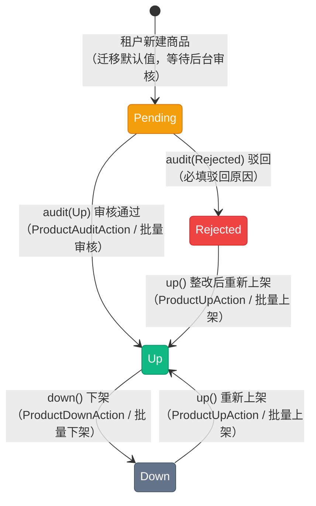

# 商品状态流转图

> 商品状态（`App\Enums\Mall\ProductStatus`），模型 `App\Models\Mall\Product`。该枚举**未实现 `HasStateMachine`**，但 `App\Services\Mall\ProductService` 对每个动作都做了显式的前置状态校验（本模块是少数几个在服务层硬校验流转的模块之一）。状态仅存在于商品维度，**SKU 没有状态字段**（只有 `stock` / `sale`），因此不存在单品下架的概念。

## 一、状态说明

| 状态 | 枚举 | 值 | 颜色 | 说明 |
|------|------|-----|------|------|
| 审核中 | Pending | `pending` | amber | 新建商品的默认状态，等待后台审核 |
| 上架中 | Up | `up` | emerald | 已上架，C 端可见、可加购、可下单 |
| 被驳回 | Rejected | `rejected` | red | 审核不通过，驳回原因写入 `ext.audit_reason` |
| 已下架 | Down | `down` | slate | 已下架，C 端不可见、不可下单 |

> 新建商品的状态来自数据库默认值（`database/migrations/0003_01_00_000001_create_products_table.php:55-58`，`default = pending`），模型层不额外设置。

---

## 二、状态流转图

**状态流转：**

- 新建 → `Pending` →（审核）`Up` 或 `Rejected`
- `Rejected` / `Down` → `Up`（同一个 `up()` 方法，**跳过审核**，即瑕疵整改后无需再次审核即可上架）
- `Up` → `Down`
- 不存在 `Pending → Down`、`Up → Rejected`、`Down → Pending` 等路径

---

## 三、状态流转规则

来源：`app/Services/Mall/ProductService.php`（唯一硬校验点）。

| 当前状态 | 可流转到 | 动作 | 校验与失败提示 |
|----------|----------|------|----------------|
| Pending | Up / Rejected | `audit()` | 目标状态必须在 `AUDITABLE_TARGETS`（Up / Rejected），否则抛「审核目标状态无效」；非 Pending 抛「仅审核中的商品可进行审核操作」 |
| Down / Rejected | Up | `up()` | 不在允许集合内抛「当前状态不可上架: {状态中文名}」 |
| Up | Down | `down()` | 非 Up 抛「仅上架中的商品可下架」 |
| Up | -（不可重审） | `audit()` | Pending 之外一律拒绝 |
| Rejected | -（不经审核直接 up） | - | `up()` 允许 Rejected，**没有二次审核环节** |

---

## 四、操作对应状态流转

来源：`App\Services\Mall\ProductService`、`app/Filament/Actions/Mall/`。

| 操作 | 方法 | 入口 | 前置状态 | 后置状态 |
|------|------|------|----------|----------|
| 审核 | `audit()` | `ProductAuditAction`（**仅后台**，列表页 :99 / 详情页 :23）、`ProductBulkAuditAction`（后台列表批量） | Pending | Up / Rejected |
| 上架 | `up()` | `ProductUpAction`（租户 :109 / 后台 :100）、`ProductBulkUpAction`（两侧） | Down / Rejected | Up |
| 下架 | `down()` | `ProductDownAction`（租户 :110 / 后台 :101）、`ProductBulkDownAction`（两侧） | Up | Down |

> **权限分工：** 审核动作只挂在后台（Backend）面板；租户只能自行上下架自己的商品，不能审核。

**审核表单：** 选择「通过 / 驳回」（默认通过），选择驳回时必填「驳回原因」，写入 `product.ext.audit_reason`。

---

## 五、副作用

| 时点 | 副作用 | 位置 |
|------|--------|------|
| 状态变更（任意） | `Product::boot()` 的 `updated` 钩子把本次脏字段（含 `status`）写入 `product_logs`，带操作人 `user_type` / `user_id` | `app/Models/Mall/Product.php:71-88` |
| 审核（驳回） | `ext.audit_reason` 记录驳回原因 | `ProductService::audit()`（:43-47） |

**对下游的影响（状态即权限）：**

| 场景 | 行为 | 位置 |
|------|------|------|
| C 端商品列表 | 只查 `ofUp()` | `app/Http/Controllers/Mall/ProductController.php:38` |
| C 端商品详情 / 加购 / 收藏等 | 4 处 `status !== Up` 直接拒绝 | 同上（:105、:124、:170、:193） |
| 购物车结算 | 3 处校验 `status !== Up`，下架后购物车中的商品不可下单 | `app/Services/Mall/CartService.php:32`、`:106`、`:195` |

**无资金变动**，不写账户流水。

**并发与幂等：** 各动作是「读状态 → 判断 → 更新」，无行锁与原子 CAS；并发下可能出现同一商品被同时上架 / 下架，最终状态取最后写入者。

---

## 六、实现缺口

| 缺口 | 影响 | 相关位置 |
|------|------|----------|
| 无自动下架 | 库存归零、活动结束不联动状态，需人工下架 | 无定时任务 / 事件监听 |
| 驳回后无需复审 | `Rejected → Up` 绕过审核，审核约束可被绕过 | `ProductService::up()`（:61） |
| SKU 无状态 | 无法按规格下架，只能整商品下架 | `skus` 表无 `status` 字段 |
| 无下架原因 | 下架不记录原因，事后难追溯 | `ProductService::down()` |
| 无状态机约束 | 新增入口需自行复刻 `up()` / `down()` 的校验 | 无 `HasStateMachine` |

---

## 七、终态说明

商品状态**没有终态**：`Up`、`Down`、`Rejected` 之间可以循环流转，`Up` 是唯一的「对 C 端可见」状态。删除走软删除（`SoftDeletes`），与状态无关。
