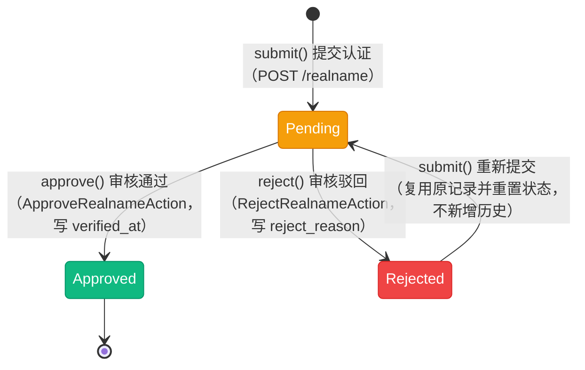

# 实名认证状态流转图

> 实名认证状态（`App\Enums\User\RealnameStatus`），模型 `App\Models\User\UserRealname`。该枚举**未实现 `HasStateMachine`**，流转由 `App\Services\User\RealnameService` 维护。同一用户同一认证类型只保留一条记录（`unique(user_id, type)` 兜底），按 `RealnameType` 分个人认证与企业认证两条独立记录线，互不影响。身份证号落库为 AES 密文，仅在 `decryptedIdCardNumber()` 显式调用时解密。

## 一、状态说明

| 状态 | 枚举 | 值 | 颜色 | 说明 |
|------|------|-----|------|------|
| 待审核 | Pending | `pending` | warning | 已提交资料，等待租户 / 后台审核 |
| 已认证 | Approved | `approved` | success | 审核通过，写 `verified_at`（终态） |
| 已拒绝 | Rejected | `rejected` | danger | 审核驳回，写 `reject_reason`，可重新提交 |

**认证类型（`RealnameType`）：** 个人认证 `personal` / 企业认证 `enterprise`。个人认证必填身份证号与正反面照片，企业认证另需营业执照。

---

## 二、状态流转图

**状态流转：**

- 首次提交 → `Pending`
- `Pending` → `Approved`（终态，不可再次提交）
- `Pending` → `Rejected` → 重新提交回到 `Pending`（**唯一回环**）
- 提交时的状态守卫（`RealnameService::submit()`）：
  - 已是 `Approved` → 抛「「xx认证」已通过认证，不可重复申请」
  - 已是 `Pending` → 抛「实名认证审核中，请勿重复提交」
  - `Rejected` 或不存在记录 → 允许提交；`Rejected` 时**复用原记录**（软删过的先 `restore()`）并清空 `verified_at` / `reject_reason` 后重置为 `Pending`，不新增历史行

---

## 三、状态流转规则

无状态机约束，下表为**各方法校验后代码实际允许**的流转。

| 当前状态 | 可流转到 | 触发 | 校验位置 |
|----------|----------|------|----------|
| - | Pending | `submit()` 提交 | `app/Services/User/RealnameService.php:31` |
| Pending | -（拒绝重复提交） | `submit()` | 同上（:42，抛「审核中，请勿重复提交」） |
| Rejected | Pending | `submit()` 重新提交 | 同上（:52-65） |
| Approved | -（拒绝重复申请） | `submit()` | 同上（:38） |
| Pending | Approved | `approve()` | 同上（:73） |
| Pending | Rejected | `reject()` | 同上（:89） |

> **注意：** `approve()` / `reject()` 内部**没有状态前置校验**，只靠 Filament 动作的可见性（`status === Pending`）约束入口。若后续新增接口或批量动作，需自行补状态校验，否则可对已审核记录重复审核。

---

## 四、操作对应状态流转

来源：`App\Services\User\RealnameService`、`App\Http\Controllers\User\RealnameController`、`app/Filament/Actions/User/`。

| 操作 | 方法 | 入口 | 前置状态 | 后置状态 |
|------|------|------|----------|----------|
| 提交认证 | `submit()` | 用户端 `POST /realname`（`RealnameController::store()`） | 非 Approved / 非 Pending | Pending |
| 查询最新记录 | - | `GET /realname`（`index()`，未提交时返回空 + 「暂未提交实名认证」） | 任意 | 不变 |
| 查询认证状态 | - | `GET /realname/status`（`status()`，轻量、无敏感资料） | 任意 | 不变 |
| 审核通过 | `approve()` | `ApproveRealnameAction`（后台 + 租户侧的列表页与详情页） | Pending | Approved |
| 审核驳回 | `reject()` | `RejectRealnameAction`（同上，需填拒绝原因） | Pending | Rejected |

**管理入口（均实现 Approve / Reject 两个动作）：**

| 面板 | 列表 | 详情 |
|------|------|------|
| 后台 | `app/Filament/Backend/Clusters/User/Resources/Realnames/Tables/RealnamesTable.php:61` | `.../Pages/ViewRealname.php:19` |
| 租户 | `app/Filament/Tenant/Clusters/User/Resources/UserRealnames/Tables/UserRealnamesTable.php:52` | `.../Pages/ViewUserRealname.php:19` |

---

## 五、副作用与数据安全

| 时点 | 副作用 | 位置 |
|------|--------|------|
| 提交认证 | 身份证号经 `idCardNumber` 写入器 AES 加密后落库；`verified_at` / `reject_reason` 置空 | `app/Models/User/UserRealname.php:38-43`、`RealnameService::submit()`（:46） |
| 审核通过 | 派发 `UserRealnameApproved` 事件 | `RealnameService::approve()`（:80） |
| 审核驳回 | 派发 `UserRealnameRejected` 事件（带拒绝原因） | `RealnameService::reject()`（:96） |
| 读取资料 | 身份证 / 营业执照图片通过 `temporary_file_url()` 生成临时 URL（`shouldCache`） | `UserRealname`（:66-95） |

**无资金变动**，不写账户流水。

**并发与幂等：**

- 同一用户同一类型的唯一性由数据库 `unique(user_id, type)` 兜底，`submit()` 内部先查后写（查重与写入之间无锁，极端并发下依赖唯一约束报错）
- `approve()` / `reject()` 是「直接 `update`」，重复调用不会报错（后写覆盖前写）

---

## 六、实现缺口

| 缺口 | 影响 | 相关位置 |
|------|------|----------|
| 审批动作无状态校验 | 服务层可重复审核；新增入口时容易漏校验 | `RealnameService::approve()` / `reject()` |
| 事件无监听者 | `UserRealnameApproved` / `UserRealnameRejected` 派发后没有任何 Listener（`app/Listeners/User/` 下无对应用户实名监听），通过认证不会联动发身份 / 通知 | `app/Events/User/UserRealnameApproved.php` |
| 无自动审核 | 全流程人工，无第三方实名通道对接 | - |
| 无撤销 / 重新认证 | `Approved` 后无法变更或作废认证 | `submit()`（:38 直接拒绝） |
| 无审核超时提醒 | `Pending` 长期滞留无告警 | - |

---

## 七、终态说明

| 状态 | 说明 | 是否可删除 |
|------|------|------------|
| Approved | 已认证，终态；不可重复申请、无撤销入口 | 否 |
| Rejected | 可重新提交（回到 Pending）；记录可软删除 | 是（表支持软删除） |
