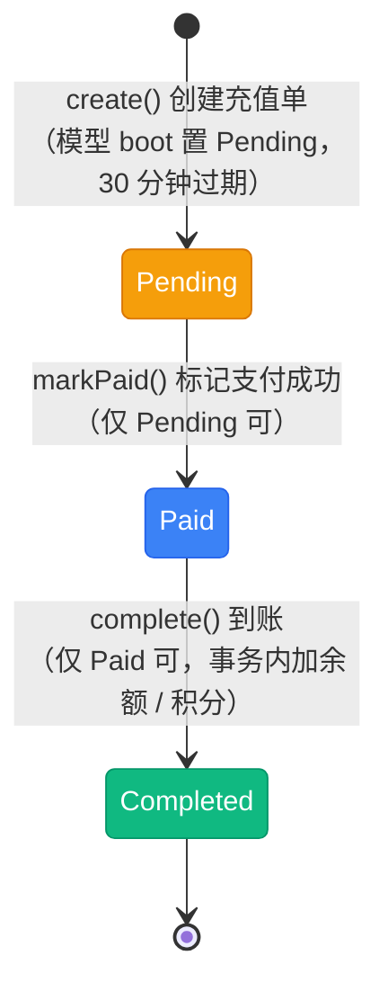

# 充值状态流转图

> 充值订单状态（`App\Enums\Finance\RechargeOrderStatus`），模型 `App\Models\Finance\RechargeOrder`（实现 `ShouldPayment`，通过 `paymentable` 多态挂到支付单上）。该枚举**未实现 `HasStateMachine`**，流转合法性由 `App\Services\Finance\RechargeService` 各方法的状态前置校验维护。充值类型由 `RechargeOrderType` 区分（余额 `Balance` / 积分 `Points`），决定到账资产。

## 一、状态说明

| 状态 | 枚举 | 值 | 颜色 | 说明 |
|------|------|-----|------|------|
| 待支付 | Pending | `pending` | amber | 充值单已创建，等待支付 |
| 支付处理中 | Processing | `processing` | sky | 支付处理中（**未实现**） |
| 已支付 | Paid | `paid` | info | 支付成功，等待到账 |
| 已完成 | Completed | `completed` | emerald | 已到账，余额 / 积分已增加 |
| 支付失败 | Failed | `failed` | red | 支付失败（方法已实现，**无调用方**） |
| 已取消 | Canceled | `canceled` | rose | 超时或用户取消（**未实现**） |

---

## 二、状态流转图

### 2.1 已实现链路



**状态流转：**

- Pending → Paid → Completed，两段都要求严格的前置状态（`markPaid()` 仅接受 `Pending`，`complete()` 仅接受 `Paid`），不满足直接抛「充值订单状态不正确」
- **触发方式：** 支付成功后由 `PaymentService::markPaidWithBusiness()` 统一推进（微信支付回调 `POST /payments/{payment}/notify` 与余额支付共用同一出口），两步在同一个事务内连续执行，充值单不会停留在 `Paid`
  - 余额支付路径虽然共用出口，但 `payByBalance()` 明确拒绝充值单（「充值订单不支持余额支付」），因此充值单实际只会由第三方回调推进
- `Paid` 是中间态，仅作为 `complete()` 的入口条件；`complete()` 失败会抛异常并回滚整笔支付推进，可重试
- 到账资产由 `RechargeOrderType` 决定：`Balance` → 余额，其余 → 积分（`RechargeService::complete()`）

### 2.2 未实现 / 未接线状态

```mermaid
stateDiagram-v2
    [*] --> Pending : create() 创建充值单

    Pending --> Paid : markPaid()
    Paid --> Completed : complete()

    state "支付处理中 Processing（未实现）" as Processing
    state "已取消 Canceled（未实现）" as Canceled
    state "支付失败 Failed（方法已实现，无调用方）" as Failed

    Pending -.-> Processing : 无写入方
    Pending -.-> Failed : markFailed() 存在但无调用
    Pending -.-> Canceled : 超时（无定时任务）

    classDef pending fill:#f59e0b,stroke:#d97706,color:white
    classDef paid fill:#3b82f6,stroke:#2563eb,color:white
    classDef completed fill:#10b981,stroke:#059669,color:white
    classDef missing fill:#e5e7eb,stroke:#9ca3af,color:#374151
    classDef todo fill:#f3f4f6,stroke:#d1d5db,color:#6b7280

    class Pending pending
    class Paid paid
    class Completed completed
    class Processing missing
    class Canceled missing
    class Failed todo
```

---

## 三、状态流转规则

无状态机约束，下表为**各方法校验后代码实际允许**的流转。

| 当前状态 | 可流转到 | 触发 | 校验位置 |
|----------|----------|------|----------|
| Pending | Paid | `RechargeService::markPaid()` | `app/Services/Finance/RechargeService.php:123` |
| Pending | Failed | `RechargeService::markFailed()` | 同上（:145）—— 方法存在但无调用方 |
| Paid | Completed | `RechargeService::complete()` | 同上（:72） |
| Completed | -（终态） | - | `complete()` 再次调用会被前置校验拒绝 |
| Processing / Canceled | -（无入口） | 支付处理中 / 超时取消 | 未实现，无任何写入方 |

---

## 四、操作对应状态流转

来源：`App\Services\Finance\RechargeService`、`App\Http\Controllers\Finance\RechargeController`、`App\Services\Finance\PaymentService`。

| 操作 | 方法 | 入口 | 前置状态 | 后置状态 |
|------|------|------|----------|----------|
| 创建充值单 | `create()` | `POST /recharge`（`RechargeController::store()`） | - | Pending（`expired_at` = 当前 +30 分钟） |
| 查询充值单 | - | `GET /recharge/{order}`、`GET /recharge` | 任意 | 不变 |
| 标记支付成功 | `markPaid()` | `PaymentService::markPaidWithBusiness()` | Pending | Paid |
| 到账 | `complete()` | `PaymentService::markPaidWithBusiness()` | Paid | Completed |
| 标记支付失败 | `markFailed()` | 无调用方 | Pending | Failed |

**调用链（2026-09-11 打通）：**

```
微信支付回调 POST /payments/{payment}/notify
  └─ PaymentController::notify()              校验 out_trade_no 与 trade_state
       └─ DB::transaction
            └─ PaymentService::markPaidWithBusiness()
                 ├─ 支付单 → Paid（幂等：已支付直接返回）
                 └─ paymentable 为 RechargeOrder → markPaid() + complete()
                      └─ modifyAsset() 余额 / 积分入账 + 写 user_account_logs
```

> 余额支付虽与回调共用同一出口，但 `payByBalance()` 仍明确拒绝充值单（「充值订单不支持余额支付」），所以充值单实际只由第三方回调推进。

---

## 五、资金与副作用

| 时点 | 副作用 | 位置 |
|------|--------|------|
| 创建充值单 | 无资金变动；单号由 `AutoCreateOrderNo` 生成，`received_amount` 缺省等于 `amount` | `RechargeService::create()`（:47） |
| 标记支付成功 | 仅写 `status` / `payment_no` / `paid_at` | `RechargeService::markPaid()`（:127） |
| 到账（Completed） | 事务内 `UserAccountService::modifyAsset()`：按类型增加余额或积分，写 `user_account_logs`（`UserAccountLogType::Recharge`，备注 `充值单号# {no}`，`source` 指向充值单） | `RechargeService::complete()`（:88-105） |

**幂等与并发：**

- 两个流转方法都以「当前状态必须精确匹配」为唯一守卫，重复调用会抛 `InvalidArgumentException` 并被上层捕获为错误响应
- `complete()` 的资产变动与状态更新在同一个 `DB::transaction` 内，失败整体回滚
- 账户记录用 `UserAccount::firstOrCreate()` 兜底，首次充值自动建账户（:76）

---

## 六、实现缺口

| 缺口 | 影响 | 相关位置 |
|------|------|----------|
| `markFailed()` 无调用方 | 支付失败场景无落点，`Failed` 不可达 | `RechargeService::markFailed()`（:143） |
| 无过期关闭任务 | 超时充值单永远停在 `Pending`，`Canceled` 不可达 | 无定时任务 |
| `Processing` 无写入方 | 异步支付处理中无状态落点 | - |
| 文档漂移 | `docs/apis/finance.md` 列出了「取消充值订单」接口，实际路由只有列表 / 创建 / 详情（`routes/apis/finance.php:48`） | `docs/apis/finance.md` |

> 「支付成功无回写路径」「微信回调不联动」两个缺口已于 2026-09-11 修复：`PaymentService::markPaidWithBusiness()` 作为余额支付与第三方回调的统一出口，回调成功后充值单会连续推进到 `Completed` 并完成到账。

---

## 七、终态说明

| 状态 | 说明 | 是否可删除 |
|------|------|------------|
| Completed | 到账完成，资金已入账 | 否（有 `user_account_logs` 关联） |
| Failed / Canceled | 未实现；实现后应可软删除 | 是（表支持软删除） |
| Pending | 超时后无自动关闭，会长期滞留（需人工处理） | 后台可软删除 |
