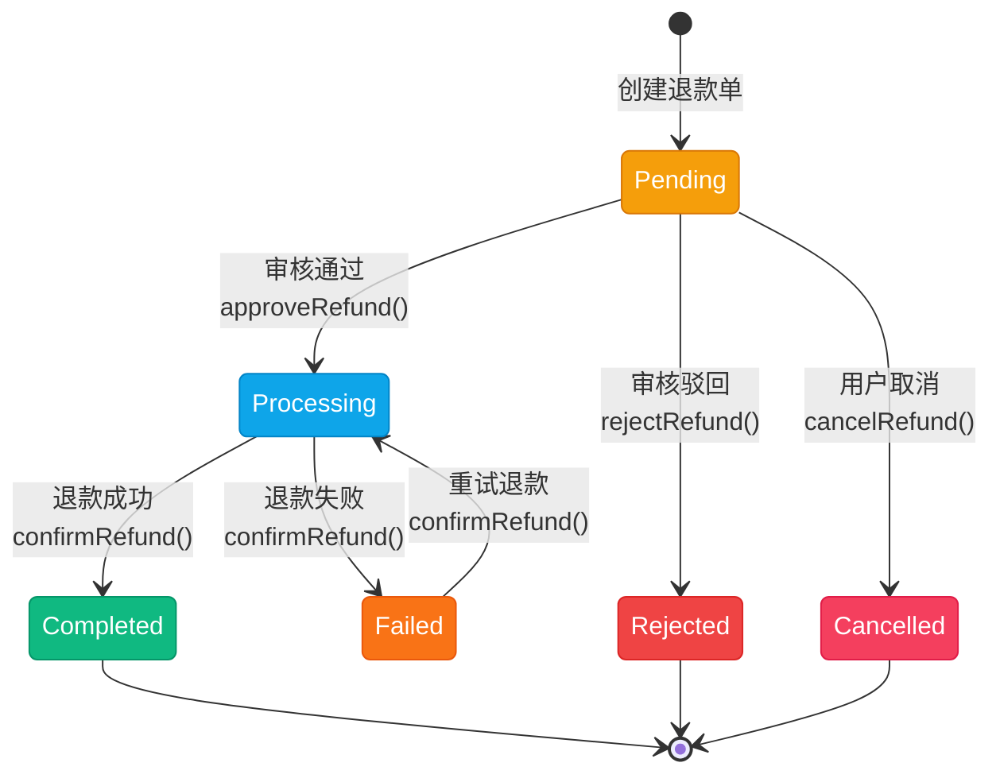
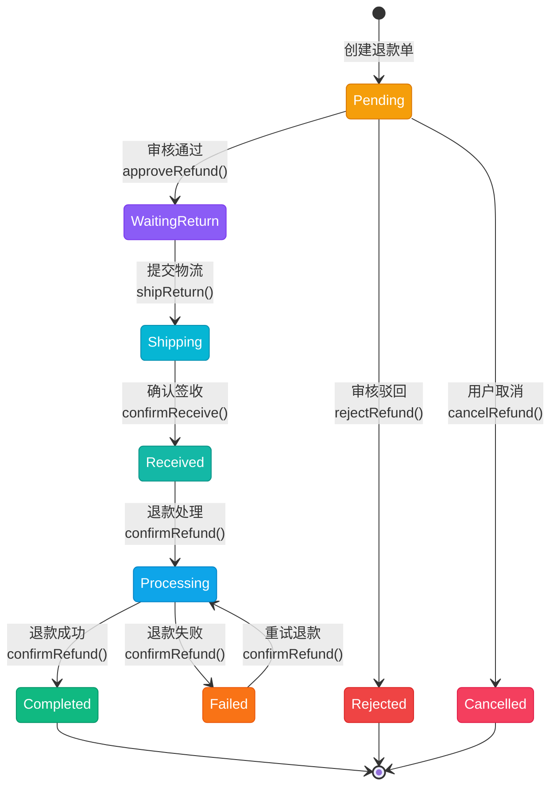
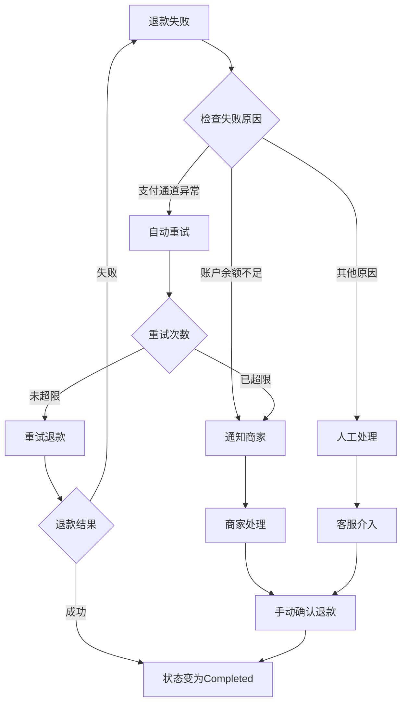

# 退款状态流转图

> 商城售后单状态（`App\Enums\Mall\RefundStatus`），服务 `App\Services\Mall\RefundService`。本图负责**商品与售后**的流转（审核、退货物流、资源回收）；**资金退回由支付侧的支付退款单执行**，见 [支付退款单状态流转图](payment-refund-status.md)：`confirmRefund()`（本单转「退款完成」）会自动生成一张待财务审核的支付退款单，审核通过后按原支付通道退回（微信原路退回 / 余额退回账户）。

## 一、状态说明

| 状态 | 英文 | 说明 | 颜色 |
|------|------|------|------|
| 待审核 | Pending | 退款申请已提交，等待审核 | amber |
| 等待退货 | WaitingReturn | 审核通过，等待用户寄回商品 | violet |
| 退货中 | Shipping | 用户已提交物流信息，商品在途 | cyan |
| 已签收 | Received | 商家已签收退货商品 | teal |
| 退款处理中 | Processing | 系统正在处理退款（仅退款直接到此状态） | sky |
| 退款完成 | Completed | 退款成功，资金已退还 | emerald |
| 审核拒绝 | Rejected | 审核不通过，退款申请被拒绝 | red |
| 已取消 | Cancelled | 用户主动取消退款申请 | rose |
| 退款失败 | Failed | 退款处理失败（如支付通道异常） | orange |

---

## 二、状态流转图

### 2.1 仅退款 (OnlyRefund)



**状态流转：**
- Pending → Processing → Completed / Failed
- Pending → Rejected（终态）
- Pending → Cancelled（终态）
- Failed ⇄ Processing（可重试）

### 2.2 退货退款 (ReturnRefund)



**状态流转：**
- Pending → WaitingReturn → Shipping → Received → Processing → Completed / Failed
- Pending → Rejected（终态）
- Pending → Cancelled（终态）
- Failed ⇄ Processing（可重试）

### 2.3 完整状态流转图

```mermaid
stateDiagram-v2
    [*] --> Pending : 创建退款单
    
    state "Pending" as Pending {
        state "待审核" as pending_desc
    }
    
    state "退款类型判断" as type_check <<choice>>
    
    Pending --> type_check : 审核通过
    
    state "仅退款流程" as only_refund {
        Processing --> Completed : 退款成功
        Processing --> Failed : 退款失败
        Failed --> Processing : 重试
    }
    
    state "退货退款流程" as return_refund {
        WaitingReturn --> Shipping : 提交物流
        Shipping --> Received : 确认签收
        Received --> Processing : 退款处理
        Processing --> Completed : 退款成功
        Processing --> Failed : 退款失败
        Failed --> Processing : 重试
    }
    
    type_check --> Processing : 仅退款
    type_check --> WaitingReturn : 退货退款
    
    Pending --> Rejected : 审核驳回
    Pending --> Cancelled : 用户取消
    
    Completed --> [*]
    Rejected --> [*]
    Cancelled --> [*]
```

---

## 三、状态流转规则

### 3.1 按退款类型

| 当前状态 | 仅退款可流转到 | 退货退款可流转到 |
|----------|----------------|------------------|
| Pending | Processing, Rejected, Cancelled | WaitingReturn, Rejected, Cancelled |
| WaitingReturn | - | Shipping |
| Shipping | - | Received |
| Received | - | Processing |
| Processing | Completed, Failed | Completed, Failed |
| Failed | Processing | Processing |
| Completed | - | - |
| Rejected | - | - |
| Cancelled | - | - |

### 3.2 操作对应状态流转

| 操作 | 方法 | 前置状态 | 后置状态 |
|------|------|----------|----------|
| 创建退款 | createRefund() | - | Pending |
| 审核通过 | approveRefund() | Pending | Processing (仅退款) / WaitingReturn (退货退款) |
| 审核驳回 | rejectRefund() | Pending | Rejected |
| 取消退款 | cancelRefund() | Pending | Cancelled |
| 提交退货物流 | shipReturn() | WaitingReturn | Shipping |
| 确认签收 | confirmReceive() | Shipping | Received |
| 确认退款 | confirmRefund() | Processing | Completed / Failed |

---

## 四、终态说明

| 终态 | 说明 | 是否可删除 |
|------|------|------------|
| Completed | 退款完成，资金已退还 | 否 |
| Rejected | 审核拒绝，退款申请被驳回 | 是 |
| Cancelled | 用户主动取消退款申请 | 是 |
| Failed | 退款处理失败 | 否（需重试或人工处理） |

---

## 五、退款失败重试

当退款处理失败（Failed）时：

1. 系统记录失败原因
2. 支持重试操作（重试后状态回到 Processing）
3. 重试次数限制由业务配置决定
4. 超过重试次数后需人工介入处理



---

## 六、退货物流状态流转（子链路）

> 退货退款链路中，「等待退货 → 退货中 → 已签收」这段的载体是独立的物流记录 `App\Models\Mall\RefundExpress`（状态枚举 `App\Enums\Mall\RefundExpressStatus`），与退款单是 `hasOne` 关联（`app/Models/Mall/Refund.php:85`）。退款单侧的状态推进由 `App\Services\Mall\RefundService` 的 `shipReturn()` / `confirmReceive()` 同时完成 —— **两个状态必须一起看**。

### 6.1 状态说明

| 状态 | 枚举 | 值 | 颜色 | 说明 |
|------|------|-----|------|------|
| 待发货 | Pending | `pending` | amber | 建表默认值（`database/migrations/0003_02_00_000002_create_refunds_table.php:126-128`），**代码从不写入** |
| 已发货 | Shipped | `shipped` | blue | 用户已提交退货物流 |
| 已签收 | Received | `received` | teal | 商家确认签收退货 |
| 已验收 | Checked | `checked` | emerald | 验收完成（**未实现**） |
| 已拒收 | Rejected | `rejected` | red | 商家拒收退货（**未实现**） |

### 6.2 状态流转图

```mermaid
stateDiagram-v2
    [*] --> Shipped : shipReturn() 用户提交退货物流<br/>（updateOrCreate 写入即 Shipped，跳过 Pending）

    Shipped --> Received : confirmReceive() 商家确认签收<br/>（写 received_at）

    state "待发货 Pending（未被写入）" as Pending
    state "已验收 Checked（未实现）" as Checked
    state "已拒收 Rejected（未实现）" as Rejected

    Received -.-> Checked : 无写入方
    Shipped -.-> Rejected : 无写入方

    Received --> [*]

    classDef shipped fill:#3b82f6,stroke:#2563eb,color:white
    classDef received fill:#14b8a6,stroke:#0d9488,color:white
    classDef missing fill:#e5e7eb,stroke:#9ca3af,color:#374151

    class Shipped shipped
    class Received received
    class Pending missing
    class Checked missing
    class Rejected missing
```

### 6.3 与退款单状态的对应关系

| 动作 | 退款单状态 | 物流状态 | 方法 |
|------|------------|----------|------|
| 用户提交退货物流 | WaitingReturn → Shipping | 写入 Shipped（含 `shipped_at`） | `RefundService::shipReturn()`（:611） |
| 商家确认签收 | Shipping → Received → Processing（同事务连跳两级） | Shipped → Received（含 `received_at`） | `RefundService::confirmReceive()`（:654） |

### 6.4 入口

| 操作 | 入口 | 可见条件 |
|------|------|----------|
| 提交退货物流 | `ShipReturnAction`（**租户侧**退款列表 :87 与详情页 :25，需填快递公司与物流单号） | 退款单为 `WaitingReturn` |
| 确认签收 | `ConfirmReceiveAction`（同上 :88 / :26，可填签收备注） | 退款单为 `Shipping` |

### 6.5 实现缺口

| 缺口 | 影响 | 相关位置 |
|------|------|----------|
| `Pending` 从不写入 | `shipReturn()` 用 `updateOrCreate` 一次性写入 `Shipped`，表默认值形同虚设 | `RefundService::shipReturn()`（:618） |
| `Checked` / `Rejected` 无写入方 | 没有「验收」「拒收」动作，商家收到货只能选择签收 | 无对应服务方法 |
| 物流记录只有一条 | `refund.express` 是 `hasOne` + `updateOrCreate`，重复提交会覆盖原记录，旧物流单号不保留 | `app/Models/Mall/Refund.php:85` |
| 无物流轨迹 | 只存快递公司与单号，不查询轨迹 | - |
