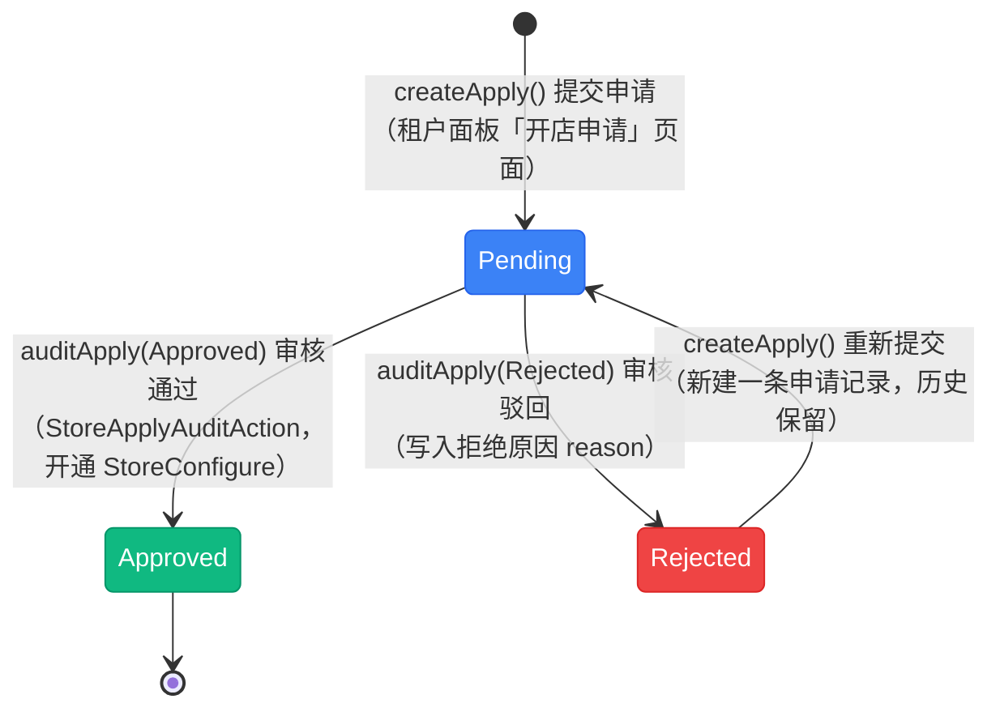

# 开店申请状态流转图

> 开店申请状态（`App\Enums\Mall\ApplyStatus`），模型 `App\Models\Mall\StoreApply`。该枚举**未实现 `HasStateMachine`**，流转由 `App\Services\Mall\StoreService` 维护。审核通过会在同一个事务里 `updateOrCreate` 该租户的店铺配置 `StoreConfigure`（`enabled = true`），作为「商城是否已开通」的总开关 —— 因此这张申请单的终态直接决定租户商城的可用性。

## 一、状态说明

| 状态 | 枚举 | 值 | 颜色 | 说明 |
|------|------|-----|------|------|
| 申请中 | Pending | `pending` | primary | 已提交开店资料，等待后台审核 |
| 已批准 | Approved | `approved` | success | 审核通过，同步开店（终态） |
| 已拒绝 | Rejected | `rejected` | danger | 审核驳回，写 `reason`，可重新提交 |

---

## 二、状态流转图

**状态流转：**

- 首次提交 → `Pending`
- `Pending` → `Approved`（终态，`StoreConfigure.enabled = true`，商城开通）
- `Pending` → `Rejected` → 重新提交回到 `Pending`（**唯一回环**）
- 提交时的状态守卫（`StoreService::createApply()`）：按租户取最近一条申请，若为 `Pending` 则抛 `DomainException`「当前已有正在审核的申请，请勿重复提交。」；`Rejected` / 无记录可提交，且**每次重新提交都是新增一条申请记录**（页面只展示 `latest()` 那条，历史保留）
- 页面侧的可提交判断在 `App\Filament\Tenant\Clusters\Mall\Pages\Apply.php:177`（`canSubmit()`：无记录或上次被拒绝），被拒绝时按钮文案变为「重新提交」

---

## 三、状态流转规则

无状态机约束，下表为**各入口校验后代码实际允许**的流转。

| 当前状态 | 可流转到 | 触发 | 校验位置 |
|----------|----------|------|----------|
| - | Pending | `createApply()` | `app/Services/Mall/StoreService.php:83` |
| Pending | -（拒绝重复提交） | `createApply()` | 同上（:93，抛 `DomainException`） |
| Rejected | Pending | `createApply()` 重新提交 | 同上 |
| Pending | Approved / Rejected | `auditApply()` | 同上（:113） |
| Approved / Rejected | -（终态） | - | - |

> **注意：** `auditApply()` 内部**没有状态前置校验**，仅由 `StoreApplyAuditAction` 的可见条件（`status === Pending`）控制入口。

---

## 四、操作对应状态流转

来源：`App\Services\Mall\StoreService`、`App\Filament\Actions\Mall\StoreApplyAuditAction.php`。

| 操作 | 方法 | 入口 | 前置状态 | 后置状态 |
|------|------|------|----------|----------|
| 提交申请 | `createApply()` | 租户面板「开店申请」页面提交（`Tenant\Clusters\Mall\Pages\Apply::submit()`） | 非 Pending | Pending |
| 审核 | `auditApply()` | `StoreApplyAuditAction`（后台 Applies 列表页 :45 与详情页 :18，仅 Pending 可见） | Pending | Approved / Rejected |

**审核表单：** 选择「通过 / 拒绝」（默认通过）+ 必填说明文本 —— 选择「拒绝」时该字段标签为「拒绝原因」、选择「通过」时为「通过备注」，分别写入 `reason` / `remark`。

**审核人留痕：** `auditApply()` 记录 `approver_type` / `approver_id` 多态字段（取 `Filament::auth()->user()`）。

---

## 五、副作用

| 时点 | 副作用 | 位置 |
|------|--------|------|
| 审核通过 | 事务内 `StoreConfigure::updateOrCreate(tenant_id)`：`enabled = true`、`store_name` 同步为申请中的店铺名称 | `StoreService::auditApply()`（:133-142） |
| 审核驳回 | 仅写 `reason`（拒绝理由），不触碰店铺配置 | 同上（:118-122） |
| 商城可用性 | 租户商城是否可用取决于 `StoreConfigure`（`MallCluster::isAvailable()`），「开店申请」页面在商城已开通时隐藏（`Apply::canAccess()` 取反） | `app/Filament/Tenant/Clusters/Mall/Pages/Apply.php:37` |

**无资金变动**，不写账户流水。

**并发与幂等：**

- `createApply()` 的查重与写入在同一事务内，但无行锁，极端并发下可能产生两条 `Pending` 申请
- `auditApply()` 是直接赋值 + `save()`，重复审核不会报错（后写覆盖）

---

## 六、实现缺口

| 缺口 | 影响 | 相关位置 |
|------|------|----------|
| 审核动作无状态校验 | 服务层可重复审核，仅靠按钮可见性兜底 | `StoreService::auditApply()` |
| 无驳回后必改要求 | 重新提交可原样提交相同资料 | `createApply()` 不做资料差异校验 |
| 重新提交新增记录 | 历史申请不断累积，页面只取 `latest()` | `StoreService::createApply()`（:97） |
| 审核通过不通知 | 无事件 / 通知派发（对比发票申请有 `InvoiceApplicationSubmitted` 通知） | `StoreService::auditApply()` |
| 无撤回入口 | 租户提交后无法主动撤回申请 | 页面无撤销动作 |

---

## 七、终态说明

| 状态 | 说明 | 是否可删除 |
|------|------|------------|
| Approved | 审核通过并已开通店铺，终态 | 否（`StoreConfigure` 依据） |
| Rejected | 可重新提交（产生新记录） | 是 |
