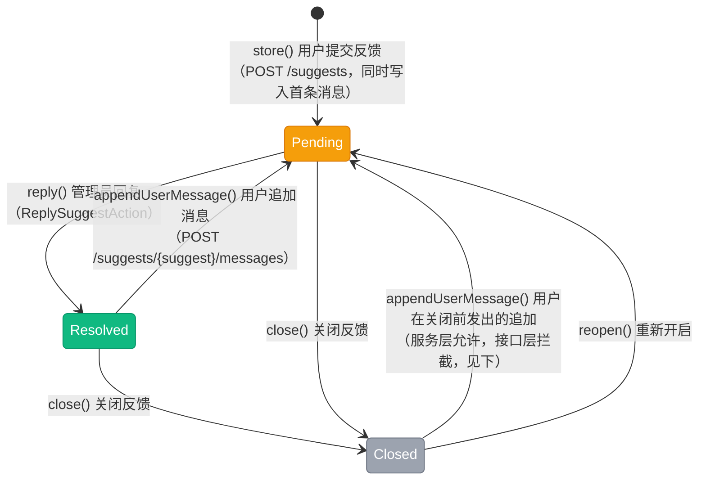

# 意见反馈状态流转图

> 意见反馈状态（`App\Enums\Content\SuggestStatus`），模型 `App\Models\Content\Suggest`，对话消息见 `App\Models\Content\SuggestMessage`。该枚举**未实现 `HasStateMachine`**，流转由 `App\Services\Content\SuggestService` 维护。这不是线性流转：用户追加消息会把状态**打回**待处理，管理员也可以随时重新开启已关闭的反馈。

## 一、状态说明

| 状态 | 枚举 | 值 | 颜色 | 说明 |
|------|------|-----|------|------|
| 待处理 | Pending | `pending` | warning | 新建 / 用户追加消息后（提醒管理员有新内容） |
| 已回复 | Resolved | `resolved` | success | 管理员已回复 |
| 已关闭 | Closed | `closed` | gray | 关闭后用户不能再追加消息 |

---

## 二、状态流转图

**状态流转：**

- 提交反馈 → `Pending`（同时写入首条消息）
- `Pending` ⇄ `Resolved`：管理员回复置 `Resolved`；用户追加消息**无条件打回** `Pending`
- `Pending` / `Resolved` → `Closed`：管理员关闭（关闭后用户无法再追加新消息）
- `Closed` → `Pending`：管理员「重新开启」（列表动作按当前状态自动切换为开启 / 关闭）
- 所有方法都是「状态不同才更新」的幂等写法（避免无意义写库）

---

## 三、状态流转规则

| 当前状态 | 可流转到 | 触发 | 校验位置 |
|----------|----------|------|----------|
| - | Pending | `store()` | `app/Services/Content/SuggestService.php:31` |
| Resolved / Closed | Pending | `appendUserMessage()` | 同上（:54）——服务层不限制 Closed |
| Pending / Closed | Resolved | `reply()` | 同上（:76） |
| 任意（非 Closed） | Closed | `close()` | 同上（:90） |
| 任意 | Pending | `reopen()` | 同上（:102） |

**接口层对 `Closed` 的拦截（与服务层不一致，注意）：**

| 位置 | 行为 |
|------|------|
| `SuggestController::storeMessage()`（`app/Http/Controllers/Content/SuggestController.php:103`） | 反馈为 `Closed` 时直接拒绝用户追加消息 |
| `SuggestService::appendUserMessage()`（:50） | 只把状态重置为 `Pending`，**不校验 `Closed`** |

因此「已关闭 → 待处理」只可能通过管理员的「重新开启」发生；服务层那条路径是冗余的防御缺口，代码调用绕过控制器时会失效。

---

## 四、操作对应状态流转

来源：`App\Services\Content\SuggestService`、`app/Filament/Actions/Content/`。

| 操作 | 方法 | 入口 | 前置状态 | 后置状态 |
|------|------|------|----------|----------|
| 提交反馈 | `store()` | 用户端 `POST /suggests`（`routes/apis/content.php:62`） | - | Pending |
| 用户追加消息 | `appendUserMessage()` | 用户端 `POST /suggests/{suggest}/messages`（`content.php:72`） | 非 Closed（控制器拦截） | Pending |
| 管理员回复 | `reply()` | `ReplySuggestAction`（后台反馈详情页的消息列表 `MessagesRelationManager:40`） | 非 Closed | Resolved |
| 关闭反馈 | `close()` | `ToggleSuggestCloseAction`（后台反馈列表 :53，需确认） | 非 Closed | Closed |
| 重新开启 | `reopen()` | 同一个 `ToggleSuggestCloseAction`（已在 `Closed` 时文案与图标切换为开启） | 任意 | Pending |
| 查询反馈 | - | 用户端列表 / 详情 | 任意 | 不变 |

**管理入口：** 仅后台面板 `app/Filament/Backend/Clusters/Content/Resources/Suggests/`（列表 + 详情 + 消息子表），**租户侧没有反馈管理资源**；后台导航徽标以 `Pending` 数量提示待处理。

---

## 五、副作用

| 时点 | 副作用 | 位置 |
|------|--------|------|
| 提交 / 追加 / 回复 | 每次都写入一条 `suggest_messages`（含 `sender_type` / `sender_id`），对话即数据 | `SuggestService::addMessage()`（:116） |
| 用户追加 | 状态重置为 `Pending`，使后台待处理数量重新出现 | `appendUserMessage()`（:55） |

**无资金变动**，不写账户流水；无事件 / 通知派发。

**并发与幂等：** 状态更新是「判断后 `update`」，无锁；并发回复 / 关闭时最终状态取决于最后写入者。消息写入与状态更新**不在同一个事务**中（`addMessage()` 先执行，随后才改状态）。

---

## 六、实现缺口

| 缺口 | 影响 | 相关位置 |
|------|------|----------|
| 服务层与控制器校验不一致 | `appendUserMessage()` 不拦 `Closed`，绕过控制器的调用可让已关闭反馈"复活" | `SuggestService.php:50` vs `SuggestController.php:103` |
| 无事件 / 通知 | 用户追加消息、管理员回复都不会通知对端，只能靠刷新查看 | 无事件派发 |
| 租户侧无入口 | 反馈只能由平台后台处理 | `app/Filament/Tenant/Clusters/Content/` 无 Suggest 资源 |
| 已回复后无再回复入口 | 只有「关闭 / 重新开启」，`Resolved` 状态下无法直接再回复（回复动作只在消息列表，需手动改） | `ToggleSuggestCloseAction` |
| 无自动关闭 | 长期无互动的反馈一直 `Pending` | 无定时任务 |

---

## 七、终态说明

本模块**没有严格终态**：`Closed` 可被管理员重新开启回到 `Pending`。业务上可视为终态的只有「用户不再回复且管理员不再开启」的 `Closed`。
