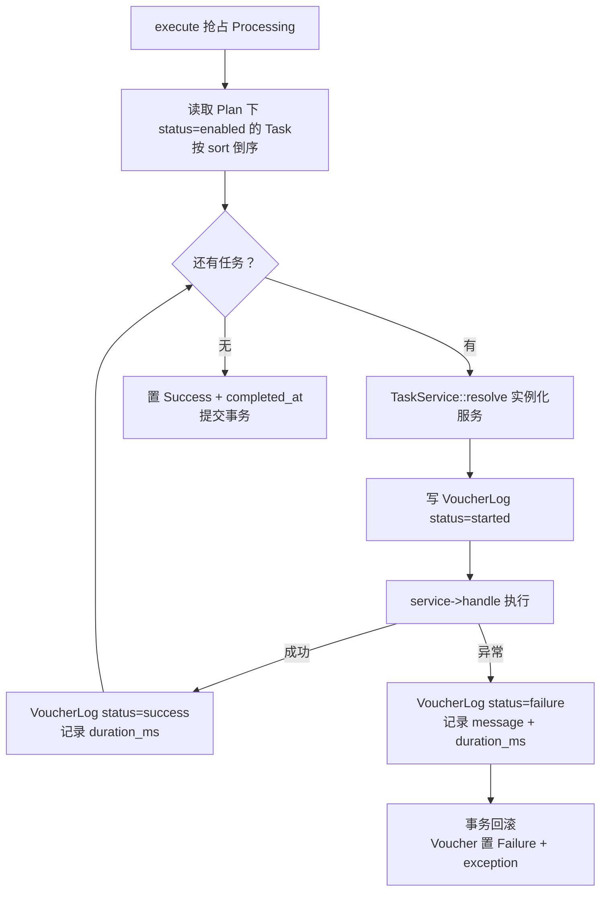

# 结算凭据状态流转图

> 结算凭据状态（`App\Enums\Finance\VoucherStatus`），模型 `App\Models\Finance\Voucher`（单号 `Sov-YYYYMMDDNNNNNN`，`no` 有唯一约束）。该枚举**未实现 `HasStateMachine`**，流转由 `App\Services\Finance\SettlementService::execute()` 用「带状态条件的原子更新」控制。凭据是结算链路的执行单元：一条凭据 = 一个结算计划 `Plan` + 一个结算目标（`target` 多态，当前支持商城订单 `Order`）+ 一串结算任务 `Task`。

## 一、状态说明

| 状态 | 枚举 | 值 | 颜色 | 说明 |
|------|------|-----|------|------|
| 待执行 | Pending | `pending` | gray | 凭据已创建，等待执行（**当前唯一可达状态，见第六节**） |
| 执行中 | Processing | `processing` | primary | 正在按顺序执行任务链 |
| 成功 | Success | `success` | success | 任务链全部通过，写 `completed_at` |
| 失败 | Failure | `failure` | danger | 任一步抛异常，事务回滚并记录 `exception` |

---

## 二、状态流转图

### 2.1 执行链路

```mermaid
stateDiagram-v2
    [*] --> Pending : Voucher::create()<br/>（模型 boot 置 Pending 并生成单号）

    Pending --> Processing : execute() CAS 抢占<br/>（仅非 Processing / Success 可）
    Failure --> Processing : execute() 重试<br/>（同一 CAS，可反复重跑）

    Processing --> Success : 任务链全部通过<br/>（写 completed_at）
    Processing --> Failure : 任一步抛异常<br/>（回滚 + 写 exception）

    Success --> [*]

    classDef pending fill:#9ca3af,stroke:#6b7280,color:white
    classDef processing fill:#6366f1,stroke:#4f46e5,color:white
    classDef success fill:#10b981,stroke:#059669,color:white
    classDef failure fill:#ef4444,stroke:#dc2626,color:white

    class Pending pending
    class Processing processing
    class Success success
    class Failure failure
```

**状态流转：**

- Pending / Failure → Processing：`SettlementService::execute()` 用 `UPDATE ... WHERE status != Processing AND status != Success` 抢占，影响行数为 0 时抛「该凭据正在结算中或已完成，请勿重复操作」
- Processing → Success：`Pipeline` 顺序跑完 `Plan` 下所有启用中的任务（按 `sort` 倒序），写入 `completed_at`
- Processing → Failure：任一步抛异常 → 事务回滚 → 状态置 `Failure` 并把异常字符串写入 `exception` 列后重新抛出
- Success 是终态：再次执行直接抛「该凭据已经结算完成，请勿重复操作」
- Failure 可无限重试，没有重试次数上限

### 2.2 任务链内部（非状态枚举，示意）



---

## 三、状态流转规则

| 当前状态 | 可流转到 | 触发 | 校验位置 |
|----------|----------|------|----------|
| - | Pending | `Voucher::create()`（模型 `creating` 钩子） | `app/Models/Finance/Voucher.php:52` |
| Pending | Processing | `execute()` CAS | `app/Services/Finance/SettlementService.php:34` |
| Failure | Processing | `execute()` CAS（重试） | 同上（:34） |
| Processing | Success | 任务链全通过 | 同上（:50） |
| Processing | Failure | 任一步抛异常 | 同上（:59-64） |
| Success | -（终态） | - | 同上（:30，直接抛异常） |
| Processing | -（抢占失败） | 并发重复执行 | 同上（:39，抛「正在结算中」） |

**CAS 语义：** 状态推进不是基于内存中的模型属性，而是 `UPDATE vouchers SET status = 'processing' WHERE id = ? AND status NOT IN ('processing','success')` 的原子更新，因此并发场景下只有一个执行者能抢到，其余直接失败退出。

---

## 四、操作对应状态流转

来源：`App\Services\Finance\SettlementService`、`App\Services\Finance\VoucherService`、`App\Jobs\Finance\VoucherAutoRunJob`。

| 操作 | 方法 | 入口 | 前置状态 | 后置状态 |
|------|------|------|----------|----------|
| 创建凭据 | `VoucherService::create()` | 代码调用（校验计划启用 / 目标为模型 / 关联有效用户） | - | Pending，并派发 `VoucherAutoRunJob` |
| 延迟执行 | `VoucherService::dispatchAutoRun()` | 同上，`scheduled_at` 为未来时间时延迟投递 | - | 到点后进入执行链路 |
| 执行 | `SettlementService::execute()` | `VoucherAutoRunJob::handle()` | 非 Processing / Success | Success / Failure |
| 手工创建 | Filament `CreateAction` | 后台「结算凭据」列表页 | - | Pending（**不派发任务，见第六节**） |
| 查询 | - | 用户端 `GET /vouchers`、后台 / 租户凭据列表 | 任意 | 不变 |

**凭据创建校验（`VoucherService::create()`）：** 计划必须启用（`Plan::isDisabled()` 为真则抛「该计划不可用」）、目标必须是模型实例、目标必须关联有效用户；`scheduled_at` 支持 `DateTimeInterface` / 时间戳（相对秒数）/ 日期字符串，早于当前时间则按立即执行处理。

---

## 五、资金与副作用

| 时点 | 副作用 | 位置 |
|------|--------|------|
| 创建凭据 | 生成单号 `Sov-YYYYMMDDNNNNNN`（取当天最大序号 +1，6 位补零） | `Voucher::generateNo()`（`app/Models/Finance/Voucher.php:66`） |
| 每个任务步骤 | 写 `voucher_logs`：`step`（任务标题）、`status`（started / success / failure）、`message`、`duration_ms` | `SettlementService::getVoucherTasks()`（:91-118） |
| 任务链成功 | 凭据置 `Success` + `completed_at` | 同上（:50-52） |
| 任务链失败 | 事务整体回滚（**含任务自身对业务数据的写入**），凭据置 `Failure` + `exception` | 同上（:59-64） |
| 具体资金变动 | 由任务实现决定，见 `app/Support/Tasks/`（如 `DirectReward` / `SecondReward`） | `Task` 表的 `service` 列指向的任务服务 |

**幂等与并发：**

- 单条凭据的重复执行由 CAS + `status === Success` 双重拦截，不会重复跑任务链
- 单号生成依赖 `no` 字段唯一约束，并发创建可能撞号并抛唯一约束冲突（模型注释中明确要求调用方自行处理或重试）
- 失败重试没有次数上限，也没有退避策略，需人工判断是否继续重试

---

## 六、实现缺口

| 缺口 | 影响 | 相关位置 |
|------|------|----------|
| `VoucherService::create()` 无调用方 | 结算链路没有业务侧入口（订单完成事件 `OrderCompletedListener` 是空实现，`VoucherService` 仅被自身引用） | `app/Services/Finance/VoucherService.php`、`app/Listeners/Mall/OrderCompletedListener.php` |
| 后台手建不派发任务 | `ManageVouchers` 的 `CreateAction` 走 Filament 直建模型，不经过 `VoucherService`，**不会投递 `VoucherAutoRunJob`**，凭据永久停在 `Pending` | `app/Filament/Backend/.../Vouchers/Pages/ManageVouchers.php:16` |
| 表单无法改状态 | `VoucherForm` 没有 `status` 字段，界面无法手工补执行 / 重置 | `app/Filament/Backend/.../Vouchers/Schemas/VoucherForm.php` |
| 租户侧无创建入口 | 租户只能查看凭据 | `app/Filament/Tenant/.../Vouchers/Pages/ManageVouchers.php` |
| 无重跑入口 | `Failure` 的重试只能靠代码再次调用 `execute()`，界面无动作 | 后台凭据列表仅 `EditAction` |

> **结论：** 结算凭据的状态机本身是完整可用的，但**缺少业务侧创建入口与后台自动执行接线**，实际数据里几乎只会看到 `Pending`。

---

## 七、相关数据模型

| 模型 | 作用 | 与凭据的关系 |
|------|------|--------------|
| `App\Models\Finance\Plan` | 结算计划，定义一组任务的集合 | `voucher.plan_id` → `plans.id` |
| `App\Models\Finance\Task` | 计划下的单个步骤（`name` / `service` / `options` / `sort` / 状态） | 经 `plan->tasks()->ofEnabled()->orderByDesc('sort')` 读取 |
| `App\Models\Finance\VoucherLog` | 每一步的执行流水 | `voucher_logs.voucher_id` → `vouchers.id`，`task_id` 可为空 |
| `App\Contracts\SettleTaskData` | 任务间传递的数据对象（携带 `voucher`） | `Pipeline::send(new SettleTaskData($voucher))` |

---

## 八、终态说明

| 状态 | 说明 | 是否可删除 |
|------|------|------------|
| Success | 结算成功，终态，不可重跑 | 否（有 `voucher_logs` 关联） |
| Failure | 可重试，非终态 | 是（表支持软删除） |
| Pending | 待执行；若来自后台手建则永不出队 | 后台列表可删除 |
