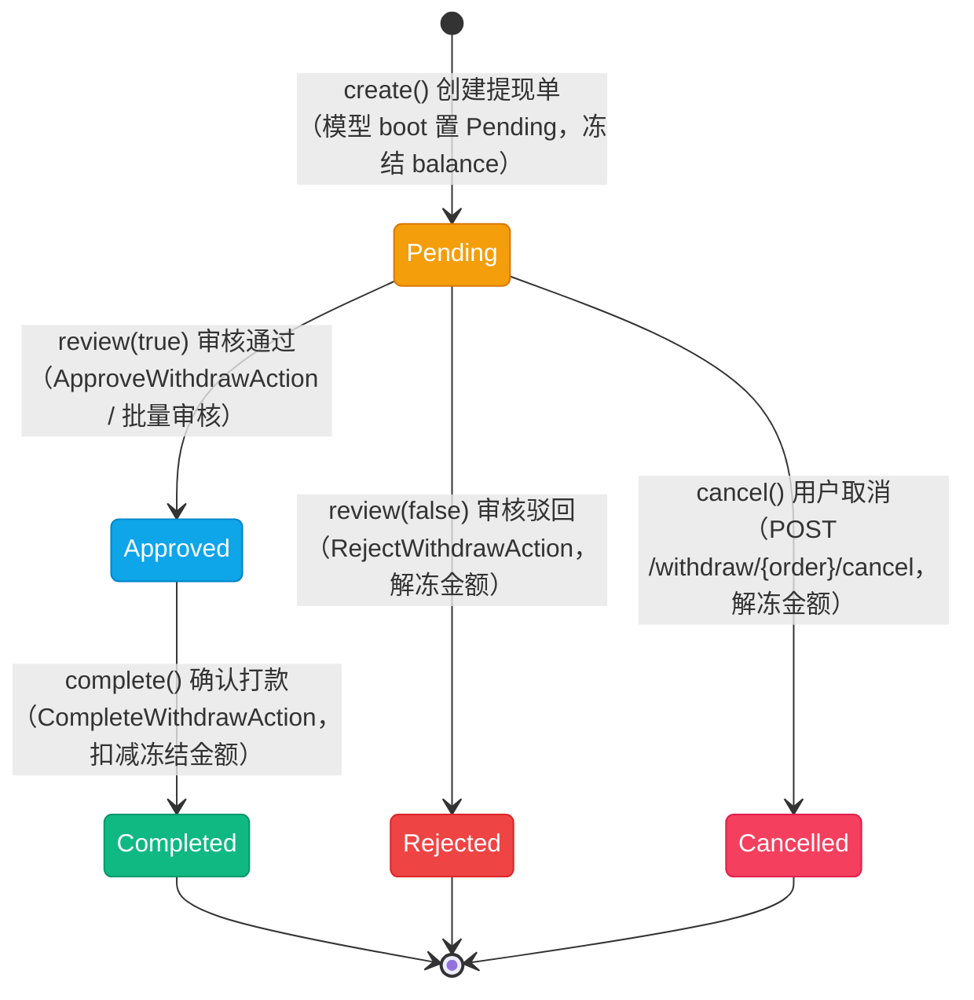

# 提现状态流转图

> 提现订单状态（`App\Enums\Finance\WithdrawOrderStatus`），模型 `App\Models\Finance\WithdrawOrder`。该枚举**未实现 `HasStateMachine`**，流转合法性由 `App\Services\Finance\WithdrawService` 各方法的前置状态校验维护（`Pending` 只能审核或取消，`Approved` 只能打款）。提现单不含租户字段，属用户级单据；后台只在 Backend 面板有管理入口（租户侧无提现资源）。

## 一、状态说明

| 状态 | 枚举 | 值 | 颜色 | 说明 |
|------|------|-----|------|------|
| 待审核 | Pending | `pending` | amber | 已创建并冻结金额，等待后台审核 |
| 审核通过 | Approved | `approved` | info | 审核通过，等待线下 / 通道打款 |
| 打款中 | Processing | `processing` | sky | 打款处理中（**未实现**） |
| 已完成 | Completed | `completed` | emerald | 已打款，冻结金额核销 |
| 已拒绝 | Rejected | `rejected` | red | 审核拒绝，冻结金额退回可用余额 |
| 已取消 | Cancelled | `cancelled` | rose | 用户取消，冻结金额退回可用余额 |

---

## 二、状态流转图

### 2.1 已实现链路



**状态流转：**

- Pending → Approved → Completed（审核通过后线下打款，`CompleteWithdrawAction` 要求填写打款流水号）
- Pending → Rejected / Cancelled 均为终态，且**都会解冻金额**退回可用余额
- 打款时只扣减 `frozen_balance`（金额在创建时已从 `balance` 扣除），不产生二次扣款

### 2.2 未实现状态

```mermaid
stateDiagram-v2
    [*] --> Pending : create()

    Pending --> Approved : review(true)
    Pending --> Rejected : review(false)
    Pending --> Cancelled : cancel()
    Approved --> Completed : complete()

    state "打款中 Processing（未实现）" as Processing
    Approved -.-> Processing : 通道打款中（无写入方）
    Processing -.-> Completed : 打款回调（无写入方）

    classDef pending fill:#f59e0b,stroke:#d97706,color:white
    classDef approved fill:#0ea5e9,stroke:#0284c7,color:white
    classDef completed fill:#10b981,stroke:#059669,color:white
    classDef rejected fill:#ef4444,stroke:#dc2626,color:white
    classDef cancelled fill:#f43f5e,stroke:#e11d48,color:white
    classDef missing fill:#e5e7eb,stroke:#9ca3af,color:#374151

    class Pending pending
    class Approved approved
    class Completed completed
    class Rejected rejected
    class Cancelled cancelled
    class Processing missing
```

---

## 三、状态流转规则

无状态机约束，下表为**各方法校验后代码实际允许**的流转。

| 当前状态 | 可流转到 | 触发 | 校验位置 |
|----------|----------|------|----------|
| Pending | Approved / Rejected | `WithdrawService::review()` | `app/Services/Finance/WithdrawService.php:109` |
| Pending | Cancelled | `WithdrawService::cancel()` | 同上（:198） |
| Approved | Completed | `WithdrawService::complete()` | 同上（:156） |
| Completed | -（终态） | - | 复核会被前置校验拒绝 |
| Rejected / Cancelled | -（终态） | - | - |
| Processing | -（无入口） | 通道打款中 | 未实现，无任何写入方 |

> **文档漂移：** `docs/apis/finance.md:533` 画的是 `approved → processing → completed` 三段式。实际实现中 `Approved` 直接到 `Completed`，`Processing` 从未被写入——以本文为准。

---

## 四、操作对应状态流转

来源：`App\Services\Finance\WithdrawService`、`App\Http\Controllers\Finance\WithdrawController`、`app/Filament/Actions/Finance/`。

| 操作 | 方法 | 入口 | 前置状态 | 后置状态 |
|------|------|------|----------|----------|
| 创建提现单 | `create()` | `POST /withdraw`（`WithdrawController::store()`） | - | Pending（冻结 `balance`） |
| 查询提现单 | - | `GET /withdraw/{order}`、`GET /withdraw`、`GET /withdraw/balance` | 任意 | 不变 |
| 取消提现 | `cancel()` | `POST /withdraw/{order}/cancel`（用户自助） | Pending | Cancelled（解冻） |
| 审核通过 | `review(true)` | `ApproveWithdrawAction`（详情页）/ `ApproveWithdrawBulkAction`（列表批量） | Pending | Approved |
| 审核驳回 | `review(false)` | `RejectWithdrawAction`（详情页，需填拒绝原因） | Pending | Rejected（解冻） |
| 确认打款 | `complete()` | `CompleteWithdrawAction`（详情页，仅 `Approved` 时可见，需填打款流水号） | Approved | Completed（扣减冻结金额） |

**创建前置校验（`WithdrawController::store()` + `WithdrawService::create()`）：**

- 金额 > 0；账户存在；已设置支付密码；`balance` ≥ 提现金额；`amount - fee` ≥ 0.01
- 微信提现（`WithdrawGateway::Wechat`）的收款 `account`（openid）由后端从用户已绑定的微信账号解析写入，不信任前端传参（`WithdrawController::store()`:67-79）

---

## 五、资金与副作用

| 时点 | 副作用 | 位置 |
|------|--------|------|
| 创建提现单 | `balance -= amount`、`frozen_balance += amount`；写 `user_account_logs`（`UserAccountLogType::Freeze`，备注「提现冻结」） | `WithdrawService::create()`（:65-79） |
| 审核通过 | 无资金变动，仅写 `reviewer_id` / `reviewed_at` | `WithdrawService::review()`（:114） |
| 审核驳回 | `frozen_balance -= amount`、`balance += amount`；写日志（`Unfreeze`，备注「提现审核拒绝，解冻金额」） | 同上（:121-137） |
| 用户取消 | 解冻逻辑与驳回一致，备注「提现取消，解冻金额」 | `WithdrawService::cancel()`（:202-220） |
| 确认打款 | `frozen_balance -= amount`；写日志（`Unfreeze`，备注「提现完成，扣减冻结金额」）；记录 `payment_no` / `paid_at` | `WithdrawService::complete()`（:160-181） |

**幂等与并发（2026-09-11 已加固）：**

- 状态校验已移入 `DB::transaction`，并以 `lockForUpdate()` 加锁读出订单行（`WithdrawService::lockOrder()`）；状态判断一律以锁内实例为准，调用方传入的旧快照不参与判断
- 账户行的读改写（冻结 / 解冻 / 扣减冻结额）同样在事务内加锁（`lockAccount()`）；创建提现单时的余额校验与冻结也已移入锁内，避免并发提现各自读到「余额充足」
- 结果：重复审核、审核通过后再取消、重复确认打款，第二次都会因锁内状态不匹配抛 `InvalidArgumentException`（「提现订单状态不正确」/「提现订单状态不可取消」），**不会重复解冻或重复扣减冻结金额**
- 批量审核（`ApproveWithdrawBulkAction`）逐条调用服务：任一条因状态冲突失败会中断整批并提示失败原因（不会留下半批成功）

---

## 六、实现缺口

| 缺口 | 影响 | 相关位置 |
|------|------|----------|
| `Processing` 无写入方 | 通道打款场景无中间态；文档与实际不符 | `docs/apis/finance.md:533` |
| 无自动过期取消 | 超时未审核的提现单一直占用冻结金额，需人工处理 | 无定时任务 |
| 无自动打款 | 打款全流程人工，无通道对接（`WithdrawGateway` 仅记录方式） | `CompleteWithdrawAction` 为纯人工动作 |
| 租户侧无入口 | 提现单只能在 Backend 面板处理 | `app/Filament/Tenant/Clusters/Finance/` 无提现资源 |

> 并发重复审核 / 重复打款的问题已于 2026-09-11 修复（事务内加行锁，见第五节）。

---

## 七、终态说明

| 状态 | 说明 | 是否可删除 |
|------|------|------------|
| Completed | 打款完成，冻结金额核销 | 否 |
| Rejected | 审核拒绝，金额已解冻 | 是（表支持软删除） |
| Cancelled | 用户取消，金额已解冻 | 是（表支持软删除） |
